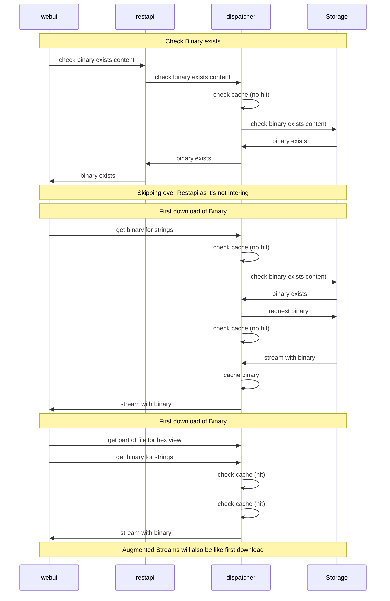
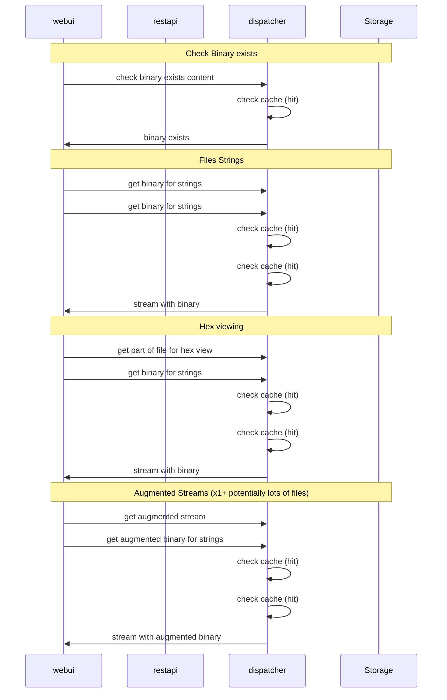

# Known Issues

This section of documentation contains known unfixed or unfixable issues in the azul code base.

## Unfixable issues

- When looking at memory usage for pendulum>=3.0.0 with `memray` usage will report as 1GB of RAM although only about 10MB of RAM is used.
  This can come up when memory debugging anything that uses azul-bedrock and azul-runner (all plugins.)

## Content Cache Hits

The content cache will be hit 2+ times whenever a binary is viewed on the UI.
This is currently expected behaviour although in the grafana metrics it can look odd that there are so many hits.

The reason for this is that the following requests are made by the UI if the binary exists.

First Viewing of a binary:

### Second viewing of the binary on the UI (e.g after page refresh):

This second viewing will result in 7 cache hits and 3 download requests.

You will also see a huge number of hits when filtering strings and hex view as every time a restapi request is made the file will be fetched.
This means that scrolling through the hex view you could get hundreds of hits.
