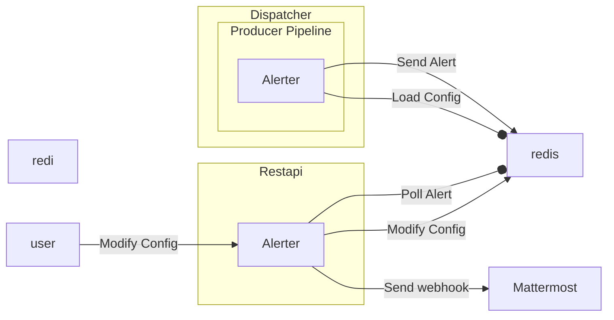

# Azul Alerter

A Restapi Plugin that is used to send out alerts to messaging platforms when specific conditions are met in Azul.

## Running Alerter locally

To run azul-alerter's restapi locally you should install azul-restapi-server and a development version of azul-alerter.

Refer to azul-restapi-server on how to startup the server locally.

## Functionallity

Alerter has a restapi component that allows users to configure their alerts and also runs a background
process which has alerts come via redis and post them to a webhook endpoint.

For alerter to work dispatcher loads the alert configuration from redis (it reloads this periodically).
It then looks at all status events produced and checks if any match the provided alert filter.

When an event matches a configured rule a post to the webhook associated with that rule is then performed.

## Dependency management

Dependencies are managed in the pyproject.toml and debian.txt file.

Version pinning is achieved using the `uv.lock` file.
Because the `uv.lock` file is configured to use a private UV registry, external developers using UV will need to delete the existing `uv.lock` file and update the project configuration to point to the publicly available PyPI registry instead.

To add new dependencies it's recommended to use uv with the command `uv add <new-package>`
    or for a dev package `uv add --dev <new-dev-package>`

The tool used for linting and managing styling is `ruff` and it is configured via `pyproject.toml`

The debian.txt file manages the debian dependencies that need to be installed on development systems and docker images.

Sometimes the debian.txt file is insufficient and in this case the Dockerfile may need to be modified directly to
install complex dependencies.
