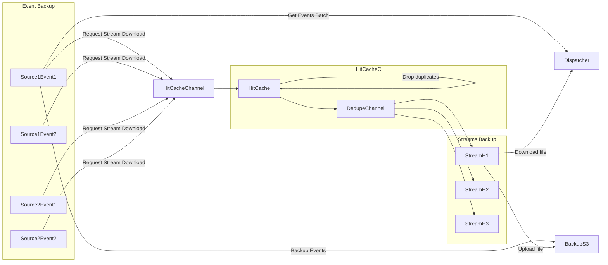
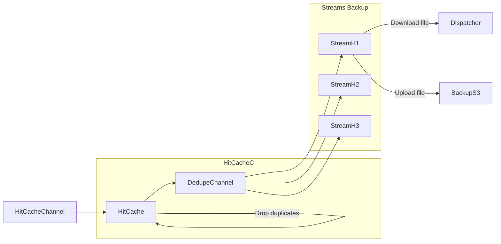
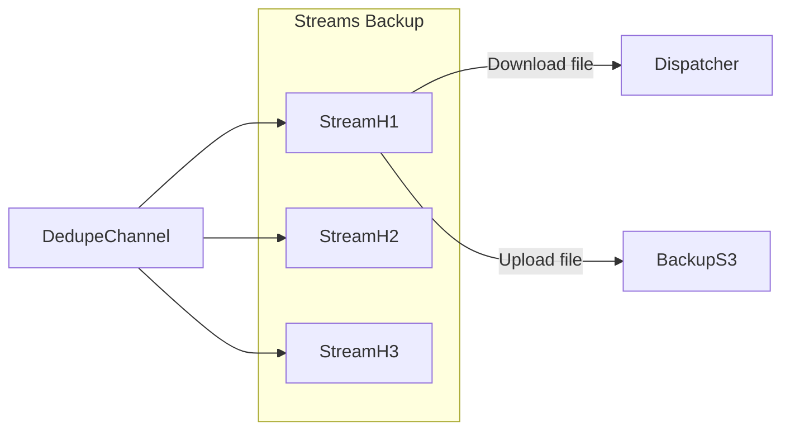
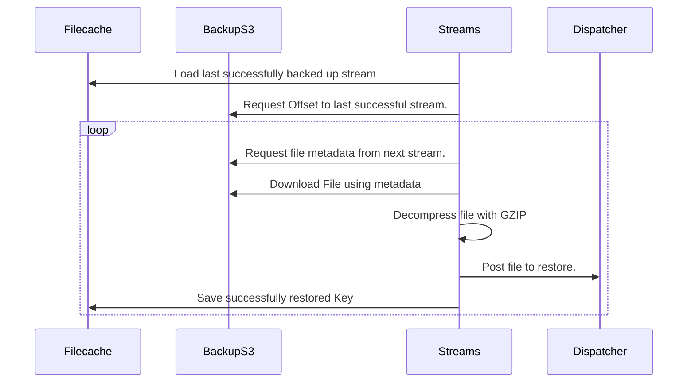

# Azul Backup

Backup & restore critical Azul data.

## Usage

Run the go binary from this package with the command `backup` or `restore`.
Set all settings via the environment variables found in the file common/settings.go

## Testing

The testify suite is being used.

This is a handy command to run a specific test case, and also gets stdout if the test deadlocks
`go test ./cmd/ -v -failfast -testify.m "TestBadDPGetBinary"`


## Testing scripts

In the scripts folder there are three scripts that can be useful for testing.

One is `run-backup.sh` another is `run-restore.sh` this allows for manual runs of backup and restore functionality.

The third script is `run-get-samples.sh` this script is used to scrape events from a running dispatcher instance,
these events are saved to the `testdata/data/samples/` folder and used for various tests.
If the avro schema changes this folder is likely to need a new set of data.

## Backup functionality

Backup splits events and streams into two separate groups of go-routines.

There are also a number of other go-routines that launch including a stream cache that de-duplicates previously seen stream objects based on their source/label/sha256 being the same.
This commonly hits on extraction events. (2/3 of events will de-duplicate in testing)

There is also a go-routine that loads streams that failed to backup the last time the plugin was running.
This go-routine reads the streams filecache file into the hitcache channel.

In the event streams can't backup the streams still it will write those same failed files to the filecache again.

#### Standard backup event processing.



### Events Backup

Events backup works by launching a go-routine per source/event pair that is configured to be backed up.

Events are then backed up in large batches (1000 events) if a large batch can't be found within 10minutes.
The number of events that could be found in the last 10minutes are backed up.
This ensures for low usage events are still backed up for a possible system failure.

When backing up events all binary objects that are listed in those events have a request to download their data sent
In a channel to the hitcache, the hitcache drops duplicates and forwards backup requests to the streams backup.

### Streams Backup

Streams backup continually reads stream download requests from the events backups and continually downloads events and
backs them up to S3. The requests are first sent through hitcache which de-duplicates streams that have already been
requested for download recently.

In the event a file cannot be backed up it's sha256 hash will be written to filecache under the streams cache.
If there are 5 files that fail to backup in a row streams calls for the system to shutdown and writes all backup requests to filecache.

The number of streams go-routines is a fixed number which is configurable by environment variable.
This allows the user to scale the backup service to their liking (if you need more or less stream handlers per event type).

### Shutdown order

When a graceful shutdown of the backup is triggered (because files can't be backed up or an events backup fails out).
There is a specific order the goroutines are killed.

1. Events backup go-routines (If events can't backup all events that couldn't be written to backup are written to the filecache.)
1. HitCache go-routine
1. Streams go-routine

The reason for this specific order is that if events are still trying to backup the hitcache needs to keep emptying
the streams to be downloaded channel and to achieve this streams needs to keep emptying the dedupe channel (output of hitcache).

In the event that a Streams go-routine can't backup object files and decides to exit it simply calls to cancel
the events go-routine context. And starts writing all objects it can't backup to filecache.

In turn once all events will receive the cancel signal they will finish backing up their last events and if they can't
backup to S3 they'll backup to disk.

Here is the backup overview after stage one (events go-routines) have ended.
Noting in the event Streams/Events can't talk to BackupS3 or Dispatcher they will write to filecache instead.

#### After events shutdown



#### After cache shutdown



## Restore functionality

Restore is much simpler than backup.
It simply restores all streams first for everything found in the S3 bucket for the selected source.

It then restores all sources/eventTypes provided for all events.

Streams is restored first so that way when the events are restored plugins can immediately run on those events and
download the binary streams instead of failing to find it.

### Streams Restore

For each provided source, streams iterates through the backup S3 bucket and restores the files by posting them to dispatcher.

Each time a file is successfully restored the key of that file is written to disk in the filecache.

This allows for the restore to resume from that file in the object store after a reboot.

This will continue until the restore is successful.

Restore Summary diagram - Streams



### Events Restore

Events has a go-routine per source/event combination.
Each one does the same thing which is described below.

Events works by first ordering all event bundles based on when they were backed up.

To achieve this it first iterates over every file in the source/event combination and gets every day a backup with
files was taken.

It then orders the days and uses the prefix of the given day and loads all events backed up on that day.
Once the that days worth of events are ordered it backs up each event in order.

If an event bundle successfully restores to dispatcher it's key is stored in the filecache.

At reboot restore then begins from the next object following that key in S3.

## StreamCache

The file cache is simply a set of commands that allow reading and writing to local disk.
It is used to save the current state of the backup or restore operation to prevent data loss of backups in the event
of an error occurring that requires a pod to reboot (In future it can handle pod deletion too by handling SIGTERM).

For restore it allows the restore to continue from the last successfully restored events/streams.
This works in the event of pod deletion or the application exiting due to too many failed backup attempts.

## Test Mocks

To re-generate the test mocks use Mockery.

```
go install github.com/vektra/mockery/v2@v2.53.5
mockery
```
