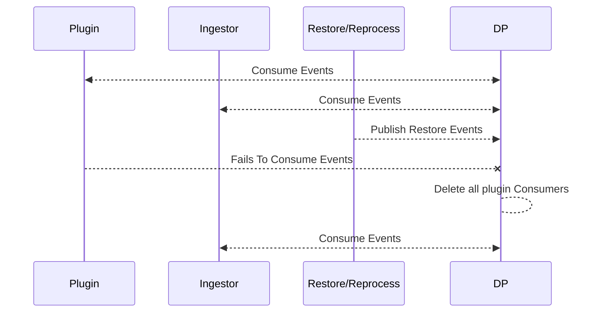

# Architecture

The Dispatcher is one of the central components of the Azul 3 system. It acts as a messaging
hub between all plugins and other system components.

It is written in golang and presents an HTTP API with several endpoints to abstract and
simplify how other components communicate and store data.

## Design

The Dispatcher is primarily an HTTP wrapper/bridge to Apache Kafka event messaging. It is
designed to share state over Kafka such that multiple instances can be run to scale
performance and provide some level of redundancy.

### Kafka

Apache Kafka is the sole messaging provider implemented. It is designed as a high-throughput,
distributed messaging broker. Producers publish to topics and consumers subscribe to
topics/topic patterns.

For a full overview of Kafka see https://kafka.apache.org

The following are some considerations for it's usage specific to Azul.

A major advantage for Azul usage is the way that consumers and topics are implemented.
Unlike many other message brokers, multiple consumers on a topic are not allocated
their own message queues server-side. Instead, they are represented as pointers/offsets
into topic partitions/segments on the servers and the corresponding messages remain available
for other consumers until aged off.

- This means creating consumers is cheap and slow consumers do not create the same
  performance problems seen in other pub/sub brokers.

- Historical messages are available for new consumers.

- (Almost) no performance overhead for subscribing/reading historical messages.

In Azul 3, _topics_ are created to represent the sources of entities (eg. binaries) and
_events_ represent changes or sightings of new entities that subscribers may be interested
in. This is a big departure from the job queues used in Azul 2 which were created one per
plugin and had to re-enqueue (historic) messages for processing.

Plugins in Azul 3 can come and go throughout the lifetime of the system and keep track of
what messages to process via _consumer group_ offsets in Kafka.

The disadvantages of using Kafka are:

- Need the broker to keep a copy of all event messages for reprocessing / new plugins.

- Message deletion becomes more complicated.

- Priority is not an in-built feature and needs to be implemented in the application.

- No way to query if/where a message is in a backlog for a consumer. Azul 2 feature.

### Topics

While topics can be set to autocreate on demand, they are generally preconfigured in Azul
to have fine control over age-off periods, partition counts, compaction, etc.

There are some general topics used by the system for certain functionality such as
deletion/autoinsert. These are prefixed with 'azul':

- azul.insert
- azul.error
- azul.expedite

Entity type forms part of the topic name structure and users will be most familiar with
'binary' which forms the basis of the malware automated processing. However, other entity
types exist for internal use like 'status' and particular plugins/feeds that use different
message types, eg. 'filescan', 'download', 'scrape'.

Other topics are defined per environment to represent the source feeds that are
available/configured. These can have different age-off periods and configuration.

- \<source-id\>.\<entity-type\>\[.data\]

eg. virustotal.filescan, reporting.binary.data

The 'data' topic name suffix is an optimisation transparently utilised by Dispatcher on
behalf of clients. It allows skipping metadata only events for clients that always require
corresponding data streams.

### Message Consumption

For maximum client/language compatibility and readability, Azul 3 uses json as a message format.
This comes at the cost of verbosity/message size but is somewhat mitigated by supporting several
compression schemes on the Kafka side.

Clients can consume event messages via the Dispatcher using either the `events` or `processing`
API endpoints. The difference is whether the Dispatcher will publish and expect _status_ response
messages for the consumed message.

**Events** is generally for bulk import/consumption or exporting to other backends. For example,
virustotal plugins use the _events_ API directly to bulk load and transform external metadata
into the system. The metastore ingest process uses the _events_ API to batch pull events and
load into ElasticSearch.

**Processing** is generally used where a plugin wants to pull events to process and contribute back
results. It is how the python plugin Runner interacts with the Dispatcher.

When consuming over HTTP a client should pass the _name_ and _version_ query parameters in requests.
This is how the Dispatcher maps clients to Kafka consumer groups and keeps track of message offsets.

### Event Types

Because Kafka is an event streaming platform, where multiple consumers subscribe for the same sets
of messages on topics, the messages should be defined in a way that describes something that occurred
or was observed happening to the listed entity.

This is a subtle difference from Azul 2 where messages represented a request for a plugin to process
an entity. In Azul 3 topics carry events informing any interested subscriber that an entity
has been produced/seen/enriched and they may want trigger some action because of it.

Within the event messages you will find fields for _entity-type_, _entity-id_ and _event_ that
capture this.

An example might be a plugin producing features for a binary would include fields:

- `entity-type`: binary

- `entity-id`: \<sha256\>

- `event`: enriched

Or malware report scraper may request a download from VirusTotal with fields:

- `entity-type`: download

- `entity-id`: \<report_ref\>.\<hash\>

- `event`: download_requested

### Event Filtering

When requesting events to consume over the HTTP APIs, a client can provide a _filter_ query param.
These are defined in GJSON Syntax https://github.com/tidwall/gjson/blob/master/SYNTAX.md

The python Runner will craft a filter on behalf of a plugin based on it's requested file-types,
max filesize configuration and other plugin properties.

Unfortunately, Kafka does not (yet?) support server-side event filtering and the Dispatcher will
perform a fast filtering of messages as they are pulled, before returning to the client.

Counts of these show up in metrics and runner logs as 'skipped' or 'uninteresting' event counts.

### Priorities

One of the features of Azul 2 was the ability to prioritise processing based on queue numbers on
submission. With Kafka, and using shared topics between plugins, Azul 3 does not support the same
mechanism.

A limited priority scheme is implemented by transparently using multiple Kafka consumers for each
plugin/client and a couple of special purpose topics.

When a new client requests events from the dispatcher, the following consumer groups are created
on the backend (with the following precedence order):

1. _expedite_ - Pulls from the `azul.expedite` topic, events that are via the UI or expedited
   by the system in some manner.

2. _errors_ - Retries errored events that are resubmitted by the system
   into the `azul.errors` topic. Message headers are used to track retry attempts
   to prevent endless retries.

3. _live_ - A consumer that will start at the head of topics when created. It will only
   consume events that arrive after its creation.

4. _historical_ - A consumer that will start at the tail of topics when created. It will consume
   all available events for its registration.

Dispatcher will then provide events only from _expedite_ to the plugins/clients until that consumer group has no
messages available. It will then move down in precedence order to _errors_ and so on until all consumer groups have no
events available.

This will allow any new named plugin or version to automatically reprocess all events still
available in the system but still give priority to user submissions and new arriving events.

The lifecycle of these consumers are in sync, such that the historical consumer continues to run
even after it may have overlapped with the starting range of the live consumer. This is catered
for by the Dispatcher through event dedupe handling, on behalf of a client.

### Plugin Topic selection and Filtering

#### Selecting topics

Topics are selected based on:

- A sources list that is provided to dispatcher by the plugin or ingestor or restapi.
- format will typically be: binary, download, status, plugin, download, filescan
- subsets: will have the value of data if the entity has data.

#### Writing to topic

The producer.go selectPartition() function holds a lot of information about how the topic to write to is selected.

If expedite is set everything is ignored and `azul.expedite` is the selected topic.

If the entity has data `<source.name>.<entity-type>.data` will be appended to the topic name.

Otherwise the topic name is the `<source.name>.<entity-type>`
source.name will be the name of the source such as incidents, test, samples, tasking, virustotal, watch
format will typically be: binary, download, status, plugin, download, filescan

### Content/Data Store

The Dispatcher currently also provides a _data_ endpoint for uploading/downloading content associated
with events. This is done to allow consistent metadata generation (hashes, filetypes, etc) on
content and could be used as a convenient hook point for storage encryption in the future.

Kafka itself is not suitable for distributing content as has tight message size restrictions.

The primary backend in Dispatcher for content storage is S3. A filesystem based store is
available but is primarily meant for development and test environments.

### Benefits

Having a service act as the messaging hub on behalf of the remaining system components adds several
benefits:

- Ability to abstract backend services such as messaging provider, storage provider (S3 vs filesystem), etc.

- Kafka can only parallelise work to consumers in a consumer group up to how many partitions exist
  for a given topic (eg. a topic with two partitions can only have two parallel consumers in the same
  group). In Azul 2 we had cases of hundreds workers competing for the same job queues which felt
  excessive to use as partition counts for every source topic (however, was not tested). By having
  an intermediate component we only need partitions up to the maximum number of Dispatcher instances
  that may be run in the system. They can then farm events out to plugin/workers based on incoming
  HTTP requests.

- Clients only need to implement HTTP and do not need any special libraries (like kafka clients)
  themselves. Opening up clients/plugins to be written in more varied languages.

- Clients do not need authentication credentials to backend services (S3 keys, Kerberos Keytabs,
  etc.) and can have available actions limited (i.e. prevented from deleting content or uploading
  with arbitrary object names). This can reduce the risk of a compromised plugin container
  causing wider impact.

- Caching and deduping functionality across plugin instances.

- Centralised metrics and monitoring.

### Drawbacks

Going down the path of a centralised dispatching service wears the risk that it becomes an
unnecessary bottle-neck and single point of failure. This is somewhat mitigated by being
able to scale the service horizontally but still introduces inefficiencies.

This is especially true for Kafka messaging which derives its performance by being able to
prefetch asynchronously into the client. In our case the Dispatcher is the client and
plugins/other components are pulling on demand over HTTP. If Azul ever grows to the scale where
these limitations become important, it could be worthwhile investigating pulling forward the logic
out from the Dispatcher into the client helpers like Runner instead. Noting the loss of some
of the benefits above.

Having a single/intermediate client responsible for registering so many Kafka consumers appears
an unusual use case and requires several workaround with the client library used (librdkafka).

- Need aggressive tuning and care to reduce excessive memory consumption

- Object lifecycles are different to expected (eg. consumer lifetimes vs client/process)

- Lose any guarantees of message reliability/redelivery and need to handle at application level

## Injector

The injector is a background services that reads all messages posted to the azul.insert topic.
Whenever a new event is created the injector check if it should inject a child entity onto the event.
This is done to enable the manual insertion of child binaries onto a parent binary as it is being processed.

When the Injector starts up it reads the entire history of the azul.insert topic into memory, in a map (aka dictionary).
It then checks every new event and if the entity.id of the new event matches the "parent.id" of the inserted event
The inserted event is added to the new event if it isn't already present.

## Pausing Plugin Processing (Restore/Reprocessing)

When a restore/reprocess is initiated Plugins are stopped from consuming events from Kafka.
Once the restore/reprocess is complete plugins are skipped ahead to latest (including their historic consumers).
This section goes into detail on how dispatcher supports this.

When an event is published to dispatcher with the parameter `pause_plugins` a timestamp is set in Redis under a key.
When consumers subsequently requests more events it will get 0 back and all the plugin consumer groups cached on the dispatcher instance will be deleted.

Ingestor consumer groups will be unaffected by the pause as shown in the diagram:

This is accomplished by Dispatcher saving the last time it saw a restore/reprocess event to redis.

What happens to Plugin consumer groups is based on when the last restore/reprocess event was:

- No last restore/reprocess event or older than 30 minutes create a plugin consumer group as normal.
- Last restore/reprocess event was seen 0-10 minutes ago, delete all plugin consumers cached on dispatcher.
- Last restore/reprocess event was seen 10-30 minutes ago, create plugin consumer groups and set the offset to Latest for `historic` and `live`.
