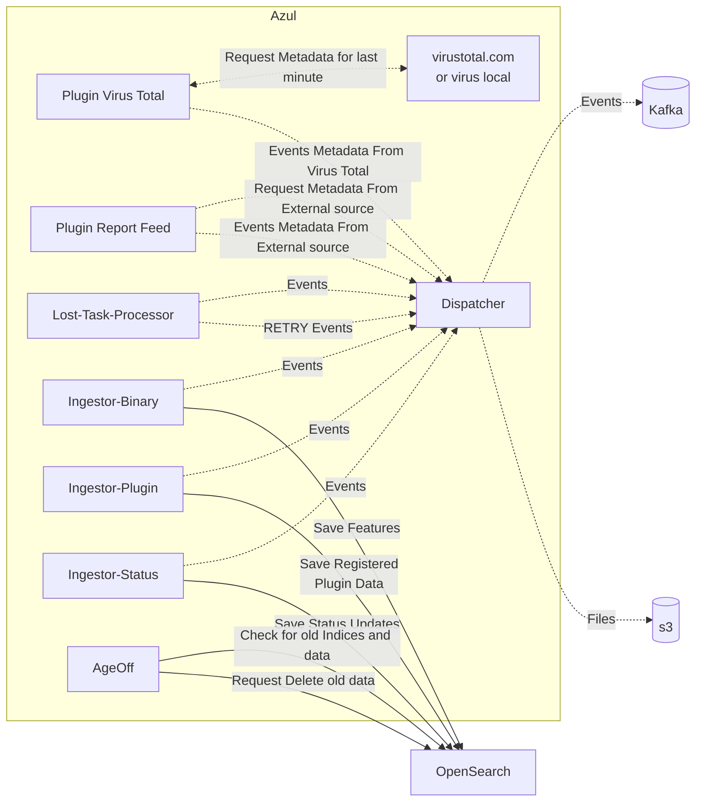

# Azul Steady State

The following diagram highlights how Azul runs without any API requests from the user.

What is noteworthy is that the ingestors continually get more data through dispatcher from the kafka topics and continue to save the data into OpenSearch.
The special plugins of virustotal and azul-report-feeds (in development) continually acquire data from their external data sources and pipe them into the appropriate kafka topics.

Note: All Ingestors and AgeOff are part of the `azul-metastore` project and are simply launched with different command line variables.
