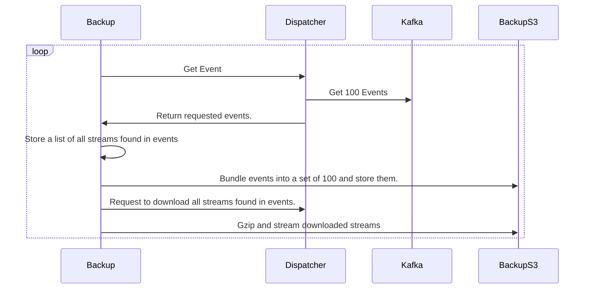
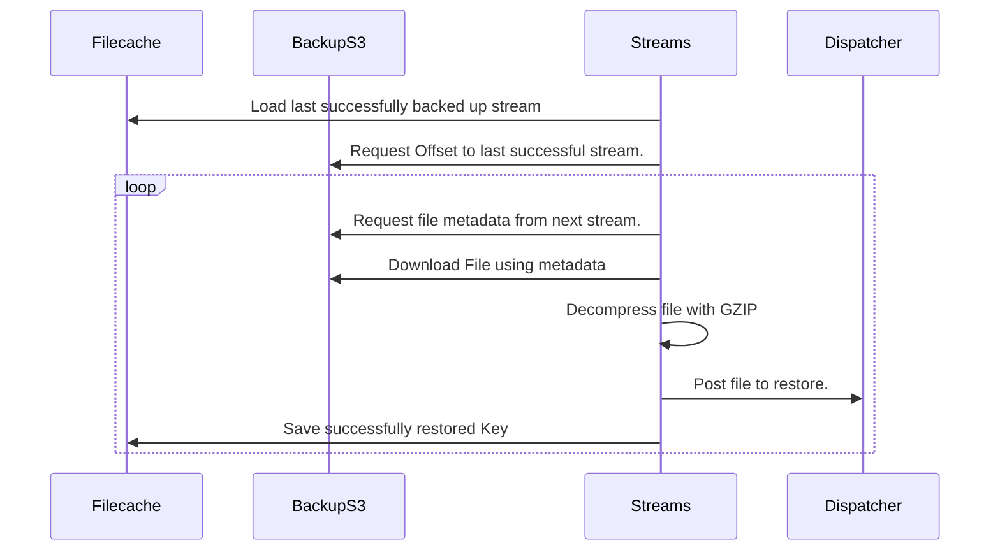

# Backup and Restore

An overview of how to perform a backup and restore within Azul.

## Backup

Backup is essentially a plugin that subscribes to all topics and downloads all the events and streams that it can and then saves them to an S3 store.

The backup runs continually and stores files in S3 in two buckets and names the files based on their source information.

The buckets:

- Streams Bucket (named `azul-bucket-<label>-streams`): (all the streams backed up in gzip format)
  - stored in the format `source/label/sha256` e.g `testing/content/31b09d8ea01a82e8fb36eb51971359be6e78313d3c521917c7bf98217719bca2`
- Events Bucket (named `azul-bucket-<label>-events`): (all the events backup in bundles or 100 and zipped)
  - stored in the format `source/action/date` e.g `testing/sourced/2025-09-01T00:20:26.33333`

A diagram of how backup works:

To configure Azul to backup all Events and Streams configure the `recovery` section of the `azul-app` helm chart.

1) Ensure all sources are set to `exclude_from_backup` if those topics shouldn't be backed up.
2) set the recovery `mode` to `backup`
3) set the externalS3Endpoint to point to the S3 server
4) Create a backup secret the key for the secret is found under `backupS3Keys` in the helm values.yaml.

Optionally enable `enableAutomaticAgeoff` which will set the rules on your Backup S3 to automatically delete backup data older than the source retains (e.g delete all data older than 2 weeks if the source ages off after 2 weeks.)

Once backup is setup you can monitor it from the grafana graph called `backup`. You can see what topics and the number of events and streams being backed up for each one.
You can also see any backup errors.

### Creating a new Backup

If you need to clear your old backup or simply want to start fresh you can trigger a new
backup by changing the value of `recovery.label` in the `values.yaml` file in the `azul-app` helm chart.

This will reset the consumer groups back to the start for all the events and the backup will start from the beginning of all the kafka topics.

## Restore

Restore works by reading from the backup S3 and posting the streams and events to dispatcher.
Streams are restored first in an arbitrary order but all sources are restored in parallel.
Events are then restored by source in parallel.

Events are restored after streams to prevent any plugin from running on events that haven't had the associated stream restored yet. Although plugins do stop processing events when he restore process beings.
This is achieved in dispatcher which stops providing jobs to plugins once it receives a restore event.

Restore can be tracked on a grafana graph called `restore`.
Once the backup is complete all plugins will skip their current processing to where the backup finished.
This is to prevent plugins running on data that has already been processed and simply been restored.
This means any data ingested during the backup will not be processed by plugins.

Below is a diagram for the restore process, it is the same for streams and for events.

NOTE - restore is fault tolerant so if the pod is rebooted it will start back from where it terminated.

To configure Azul to restore all Events and Streams configure the `recovery` section of the `azul-app` helm chart.

### triggering a restore

To trigger a restore simply set the recovery `mode` to `recovery` on the `azul-app` helm chart.
