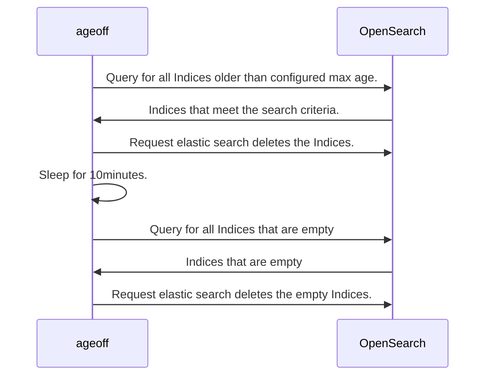

# Miscellaneous Functions

This page contains some miscellaneous components of Azul.

## Data Age Off

Ageoff is a docker container (code is in azul-metastore) that can be configured to run in Azul to delete empty indices
and old metadata from OpenSearch.
The definition of what is old and what sources to delete data from is defined in the Ageoff containers environment
variables. This varies depending on the deployment of Azul.

The process by which data is deleted by the Ageoff container is shown below:

