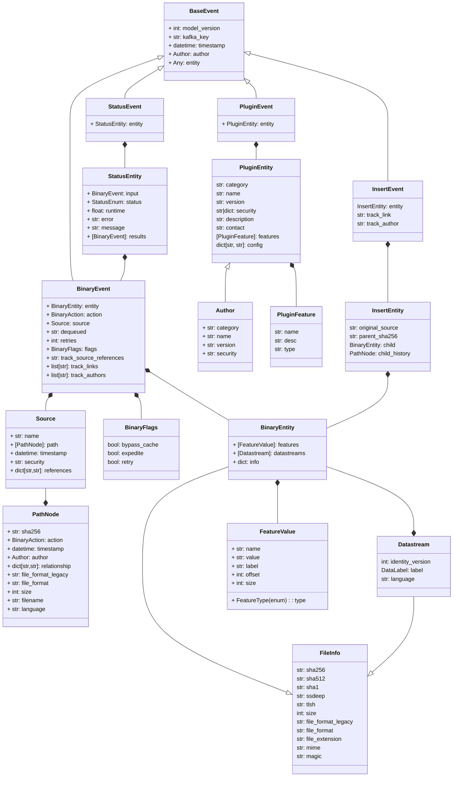

# Model Details

## Event types

There are many different types of Events in Azul.
These include:

- `Binary`: Events that hold all the resultant metadata from a plugin. This includes all the feature values and can also link to augmented and extracted files.

- `Plugin`: A plugin registration event that provides information about a plugins name, version and configuration. It's normally provided to dispatcher at plugin startup.

- `Status`: Indicate the status of a plugin's there are many statuses but common ones are `COMPLETED` `ERROR_EXCEPTION` and `OPT_OUT`.

- `Insert`: Used to manually add relationships between files. E.g if a file is a known output of a piece of malware but automated tools didn't link the two files.

- `Download`: Events used to request that a plugin attempt to download a specific file, typically raised by another plugin.
    An example is azul-plugin-report-feeds (in development) finding a sha256 on a report and requesting that the azul-plugin-virustotal attempt to download the file listed in the report.

- `Delete`: Events used to delete Azul submissions or Insert events.

- `Retrohunt`: Events retrohunt uses to track jobs it's workers are performing.

### Binary Actions

Within an Event there can also be a sub category called `action` there are present in Binary, Download, Delete and Retrohunt Events.

Binary actions are the most important and they are:

- `sourced`: A root event indicating new data entering the system, this can be by user submission or through a plugin acquiring data.
A sourced action will never have any parent event.

- `extracted`: An extracted action is generated when a plugin extracts content from a sourced or extracted action. The event can also contain metadata.
It represents an extracted new file (e.g a file found in a zip.)

- `augmented`: An Augmented event is generated when a plugin modifies the original files content to make it more readable or safer. (e.g re-creating an image to remove any malicious embedded content, decompiling code.)

- `mapped`: Used when metadata and non-content streams come from an external source. e.g metadata about a file from VirusTotal.

- `enriched`: An enriched event is a metadata only event and if the main event type that holds FeatureValues describing important information about a binary file.

#### Restrictions

There are restrictions on BinaryEvents depending on the action.

All Binary events require a `Source.Path` list exists and that there is an `Author.Name` field and an `Action` set.

Path constraints:

- `Sourced` events cannot have a parent event (`source.Path` will be length one)
- `Enriched` and `Mapped` events cannot have child events.

Datastream constraints:

- `Enriched` Actions cannot have any datastreams
- `Mapped` Actions cannot have any datastream that isn't `content` labelled.
- `Augmented`, `Sourced` and `Extracted` Must have a label that is `content`
- `Augmented` must have one or more labels that are not `content` as well as the `content` stream.

### Other Actions

For completeness the other actions are also listed.

Download actions:

- `requested`: An action requesting a download be performed.
- `success`: An action indicating that the requested file was successfully downloaded.
- `failed`: An action indicating that the requested file was not downloaded and the reason why.

Delete actions:

- `submission`: A submission action indicates that the submission and all derived files for that submission should be deleted.

- `link`: A link action indicates that ONLY the link between two binaries should be removed.

- `author`: All events that have been created by an author should be deleted from the system. This is a point in time deletion so if the author (plugin) continues to produce new events those events will not be deleted.

Retrohunt actions:

- `submitted`: A job has been submitted to the retrohunt worker(s)
- `starting`: A worker has collected the job and is preparing to search with the provided rule.
- `running`: A worker is actively searching with the provided rule. (Status updates are provided through multiple running events from the worker back to the server.)
- `completed`: The Retrohunt worker has completed it's work (this event will have the final summary of work completed for the server to read.)

## Class Diagram of Azul's Kafka Models

This diagram shows the models that are used when storing data into Kafka. In addition these models are also used for network communications between plugins, restapi, opensearch and dispatcher.

Data shown in these models are not serialized in Dispatcher and left as a binary stream.

Note: The securityLabel is mapped to the security parameters using a conversion function that can convert the field to and from a string depending on the use case.

Note: OpenSearch models are very similar but are remapped to a different structure.

---

## OpenSearch Specific Models

All the models above are also in OpenSearch however the models are restructured for Opensearch, event types map to their own index:

- *.status Index holds StatusEvents
- *.plugin Index hold AuthorEvents
- *.binary Index holds BinaryEvents

In addition there are models that exist only between azul-metastore and OpenSearch. They therefore don't go to Dispatcher, Kafka or the plugins.

The models are

- Annotations
- Cache

Annotations are mapped to an "entity" meaning a particular binary file's sha256 hash.
The Annotation could be a type of comment, a feature value tag or an entity tag.

Cache pre-calculates the feature value counts but doesn't work very well and likely to be replaced.
