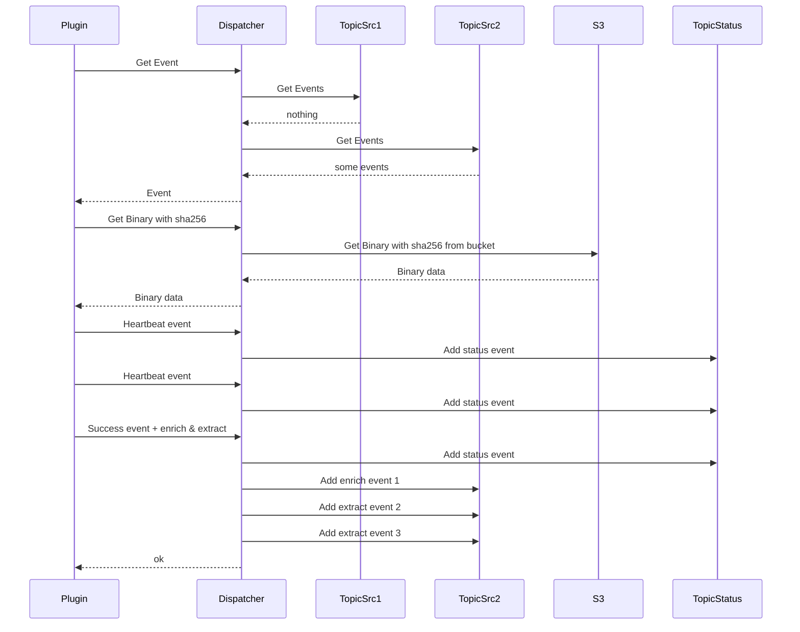
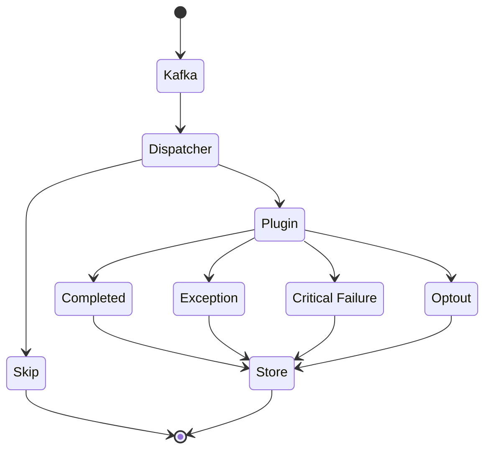
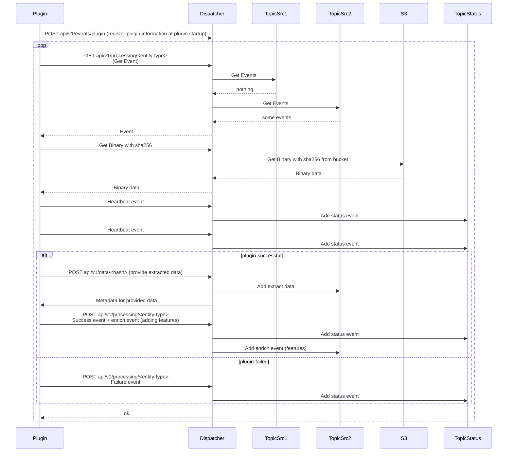
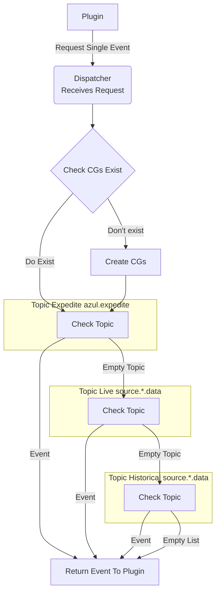

# Plugins

A typical plugin runs the Event Processing shown below. During this process the plugin continually queries dispatcher
for new jobs that are acquired from Kafka topics. During it's internal processing dispatcher saves a consumer that
buffers where in each topic the plugin is up to. It then queries each topics and takes all the messages and filters
the messages based on the plugins capabilities. This enables it to only provide the most relevant messages back to the
plugin.

## Event Processing

Plugins within Azul will register themselves when they startup providing their version number which can be used
to uniquely identify which plugin and the specific version that generated data or features.

The plugin then runs an infinite loop continually polling for new information from a topic (process shown in the diagram.)

A plugin retrieves events one at a time (in case it crashes).
It can publish multiple output events as a result of a single input event.

The dispatcher retrieves multiple events at once, so it can avoid always hitting Kafka (not shown in diagram).

### Normal Plugins

The most common kind of plugin is a binary plugin. These plugins are written in Python and inherit from BinaryPlugin
found in azul-runner. Other plugins inherit from Plugin also found in azul-runner.

Plugins that are not binary plugins but still behave similarly to binary plugins include:

- azul-plugin-netinfo
- azul-plugin-office
- azul-plugin-unbox

Note: azul-plugin-unbox: Is a significant plugin, it extracts archives and resubmits them to Azul for processing.
Otherwise it behaves the same as all plugins.

### Special Python Plugins

There are also Python plugins that expose their own RestAPI to Azul and behave differently to other plugins as a result
these are:

- azul-plugin-assemblyline: Ingests data from assemblyline and feeds it into azul
(still in development at time of writing)

- azul-plugin-retrohunt: Retrohunt indexes data to enable it to be searched with bigyara this follows the normal plugin
lifecycle. It then exposes a RestAPI which enables users to use bigyara (biggrep internally) to search over the indexed
data.

- azul-report-feeds (in development): Streams data from external sources and converts the source data into a format appropriate for Azul.
It converts the external feature data into the Azul Feature format.

### GoLang Plugins

There are three plugins written in GoLang and these use the same API endpoints to communicate with dispatcher:

- azul-plugin-virustotal: Uses the appropriate API to acquire metadata from VirusTotal or VirusLocal and converts
the ingested data into a format that Azul can use.
- azul-plugin-entropy: Behaves just like a normal binary plugin but written in golang.
- azul-plugin-goinfo: Behaves like a normal binary plugin but written in golang

## Job Processing Diagram

A job is considered to be a single event processed by a single plugin.
Hence, each plugin will traverse this state diagram for the same event in Kafka.

|  |  |
|--|--|
| Kafka            | Event sitting in kafka and waiting for dispatcher plugin pointer to catch up |
| Dispatcher       | Event read by dispatcher plugin pointer and evaluated to match plugin filters |
| Skip             | Event failed dispatcher plugin filter check |
| Plugin           | Event being executed by plugin |
| Completed        | Event execution resulted in produced data (OK, SUCCESS, COMPLETED are all the same) |
| Exception        | Event execution resulted in standard python stacktrace (plugin or library error) |
| Critical Failure | Event execution resulted in very serious error (core Azul code error) |
| Optout           | Plugin determined event was not valid for plugin |
| Store            | Event produced data being stored (in kafka via dispatcher) |

## Event Processing - Detail

A plugin initially registers itself with the dispatcher (this event is detected by the ingestor-plugin).

A plugin retrieves events one at a time (in case it crashes).
It can publish multiple output events as a result of a single input event.

The dispatcher retrieves multiple events at once, so it can avoid always hitting Kafka (not shown in diagram).

## Plugin Consuming Events from ConsumerGroups (CGs)

Plugins continually request a single event from dispatcher which they then process.
Dispatcher will create a ConsumerGroup which will then track how far a plugin has progressed through each topic.

The ConsumerGroups are actually stored on Kafka under a unique name in a custom naming format that indicates
the name of the consumer and some information about the different information it's trying to consume.
e.g historic/live/expedite.
Because this format is standardised between dispatcher instances they all watch the same consumer groups.

Also noteworthy is the topics under the consumer group Historical and Live are the same however Historical subscribes
to the topics starting at earliest and live subscribes to the topic starting at latest.
(expedite also starts at latest)

The below diagrams displays how dispatcher selects what events to provide to a new client or plugin (noting a client can ignore historic event.):

