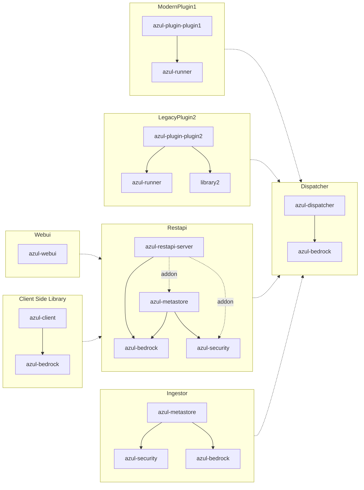

# Components & Repositories

The below diagram shows the major components of Azul and the repositories used to construct them.
Links between components indicate network interactions.

```mermaid
flowchart LR
  subgraph Restapi
    direction TB
    azul-metastore --> azul-bedrock
    azul-metastore --> azul-security
    azul-restapi-server --> azul-bedrock
    azul-restapi-server -. addon .-> azul-metastore
    azul-restapi-server -. addon .-> azul-security
  end
  subgraph Ingestor
    direction TB
    ingm[azul-metastore] --> ings[azul-security]
    ingm[azul-metastore] --> ingb[azul-bedrock]
  end
  subgraph ModernPlugin1
    direction TB
    azul-plugin-plugin1 --> p1r[azul-runner]
  end
  subgraph LegacyPlugin2
    direction TB
    azul-plugin-plugin2 --> p2r[azul-runner]
    azul-plugin-plugin2 --> library2
  end
  subgraph Dispatcher
    direction TB
    azul-dispatcher --> ind[azul-bedrock]
  end
  subgraph Webui
    azul-webui
  end
  ModernPlugin1 -.-> Dispatcher
  LegacyPlugin2 -.-> Dispatcher
  Restapi -.-> Dispatcher
  Ingestor -.-> Dispatcher
  Webui -.-> Restapi
  Client -.-> Restapi
  subgraph Client[Client Side Library]
    azul-client
    azul-client --> ine[azul-bedrock]
  end
```
