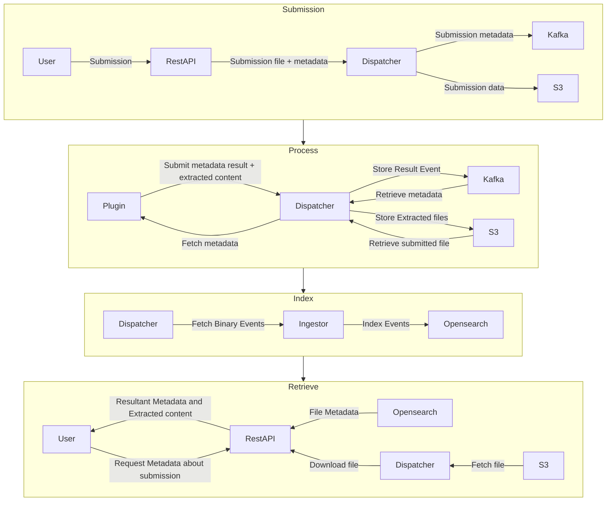
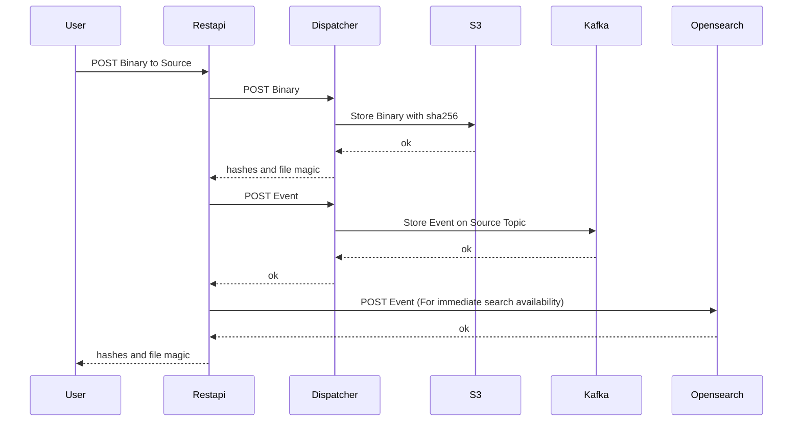
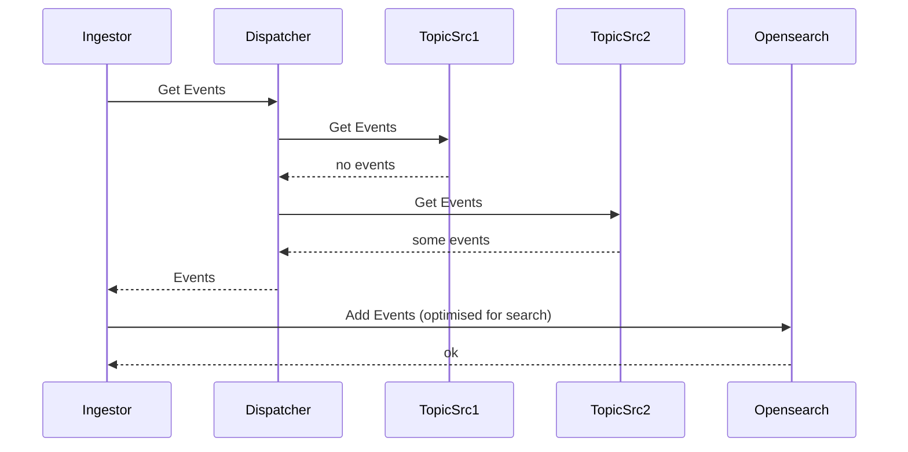

# Submission Processing

This page shows some more detail about what happens after a file is submitted to Azul.

How the file is processed and what happens with the file's metadata.

## Summary

In short a file is uploaded through Azul's UI or RestAPI and submitted to dispatcher.
Dispatcher places the uploaded file and related submission event into S3 and Kafka respectively.
Plugins continually poll for new events from dispatcher which will provide the event from Kafka to the plugin.
The plugin will then process the event and request the raw source file from S3 via dispatcher (if required).
The results will be provided back to dispatcher which stores them in Kafka.
The ingestors continually pull events from kafka and when they get the event from kafka they will index it into Opensearch.
The results will then appear on the WebUI or via the RestAPI when Opensearch is queried.

The below series of diagrams summarise this process with the arrows indicate the direction data is flowing.

## File Submission

A more detailed view of a user uploading a file results in the file being saved and an event being produced.
As the user expects to see the event immediately, it also needs to be available in Opensearch.

## Processing

For detailed information about processing refer to [plugins](./plugins.md)

## Event Ingestion/Indexing for Search

Events published to Kafka need to be transformed and ingested into Opensearch.
This is required before the events can be exposed via the external API.

Ingestors are the containers that complete this work and are continually running in a loop where they continually 
request new messages from topics. They then convert that data into an appropriate form and save it into OpenSearch.

