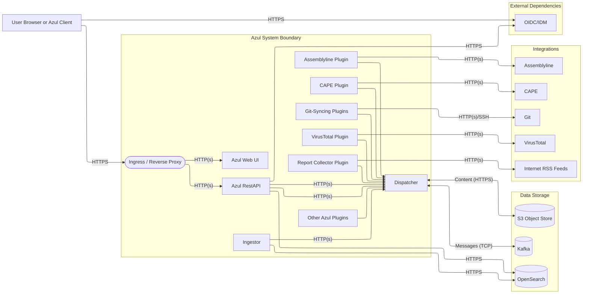

# Architecture

## System Overview

Shows a generic deployment of 'Azul' and required supporting systems. 
Azul is assumed to be running in Kubernetes.

```mermaid
---
config:
  flowchart:
    defaultRenderer: "elk"
---
flowchart LR;
subgraph SystemBoundary[Azul System Boundary]
    Ingress([Ingress / Reverse Proxy]);
    RestAPI[Azul RestAPI];
    Dispatcher;
    Web[Azul Web UI];
    Ingestor["Ingestor"];

    AssemblylinePlugin[Assemblyline Plugin];
    VirusTotalPlugin[VirusTotal Plugin];
    CAPEPlugin[CAPE Plugin];
    SyncPlugin[Git-Syncing Plugins];
    ReportCollectorPlugin[Report Collector Plugin];
    OtherPlugin[Other Azul Plugins];

    AssemblylinePlugin --> Dispatcher;
    VirusTotalPlugin --> Dispatcher;
    CAPEPlugin --> Dispatcher;
    SyncPlugin --> Dispatcher;
    ReportCollectorPlugin --> Dispatcher;
    OtherPlugin --> Dispatcher;

    RestAPI --HTTP(s)--> Dispatcher;
    Ingress --HTTP(s)--> RestAPI;
    Ingress --HTTP(s)--> Web;
end

subgraph DataStorage[Data Storage]
    Kafka[(Kafka)];
    OpenSearch[(OpenSearch)];
    S3[(S3 Object Store)];
end

subgraph Integrations
    Assemblyline;
    VirusTotal;
    CAPE;
    Git;
    RSS[Internet RSS Feeds];
end

Dispatcher <--Messages (TCP)--> Kafka;
Dispatcher <--Content (HTTPS)--> S3;
RestAPI --HTTPS-->OpenSearch;
RestAPI --HTTP(s)-->Dispatcher;
Ingestor --HTTP(s)--> Dispatcher;
Ingestor --HTTPS--> OpenSearch;

subgraph External[External Dependencies]
    OIDC[OIDC/IDM];
end

User[User Browser or Azul Client];
User --HTTPS--> Ingress;
User --HTTPS--> OIDC;

RestAPI --HTTPS--> OIDC;

AssemblylinePlugin --HTTP(s)--> Assemblyline;
VirusTotalPlugin --HTTP(s)--> VirusTotal;
CAPEPlugin --HTTP(s)--> CAPE;
SyncPlugin --HTTP(s)/SSH--> Git;
ReportCollectorPlugin --HTTP(s)--> RSS;
```

