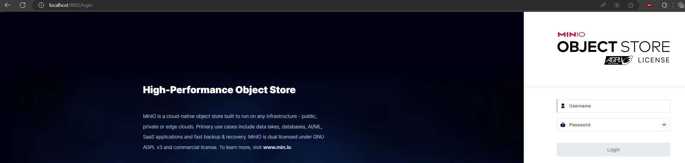
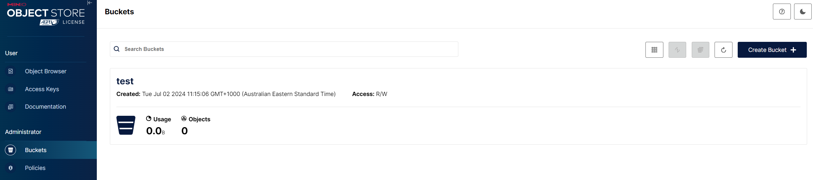
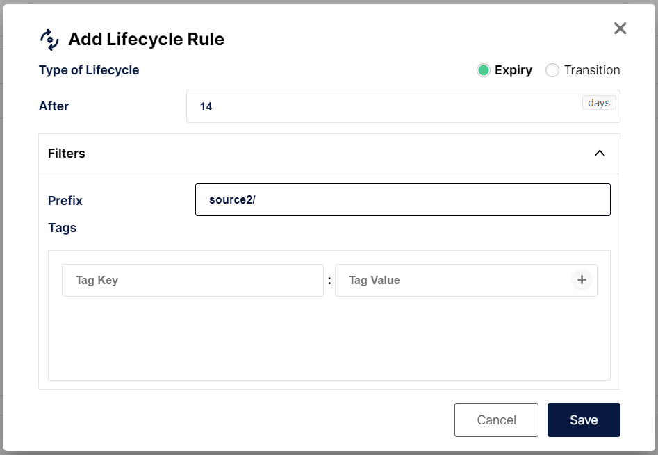

# Minio Configuration

This guide describes how to configure age off for a S3/Minio deployment.


## Setting up port forwarding

If Minio is running on Kubernetes, you may need to port forward the service if you cannot access the Minio console (Web GUI).

1. Locate the appropriate Minio deployment. For this example, Minio is running in the `infra-qa` namespace
```text
❯ kubectl get services -n infra-qa
NAME                                  TYPE        CLUSTER-IP     EXTERNAL-IP   PORT(S)                                        AGE
azul-opensearch                       ClusterIP   10.100.0.143   <none>        9200/TCP,9300/TCP,9600/TCP,9650/TCP            26d
s3-store-minio-backup                 ClusterIP   10.100.0.105   <none>        9000/TCP,9001/TCP                              40d
```
-   In the service list see `s3-store-minio-backup`, it exposes two ports: `9000/TCP,9001/TCP`.
-    9001 is the WebUI port.
-    Note: In other environments, the service may be named differently. Such as `minio-al`.


2. Port forward it, e.g. `kubectl -n infra-qa port-forward services/s3-store-minio-backup 9001:9001`

3. You may need to use VSCode or a similar tool to proxy the Port forwarding to your Desktop

4. Navigate to http://localhost:9001/ in your browser. A login page similar to the following should be displayed:




## Login to Minio

1. Acquire credentials for Minio from the secret.

   `kubectl get secret s3-backup-keys -o jsonpath='{.data}' -n infra-qa | base64 --decode`
2. The above command will produce output with the username and password in Base64 encoding.
3. Use the following command to decode the username and password: `echo 'aW...' | base64 --decode`

## Configure age off

1. Navigate to the appropriate bucket

2. Click on the Bucket -> Lifecycle -> Add Lifecycle rule
3. Set the appropriate number of days for the Lifecycle policy. Please note this will apply to the whole bucket unless you specify a prefix, so set the Prefix filter to a given source.

    Set to the source name followed by a trailing slash (e.g. `source2/`) to age-off objects in that source directory. 


 

Once you have saved the change, Minio will age off the objects after the specified time.