# Keycloak Configuration

Configure Keycloak to connect to Azul and forward required roles via OIDC JWT.

## Information Needed

- Azul url
- Opensearch url (for dashboards access)
- azul group - group name that allows azul access with user federation
  - if not using user federation, call this `azul_reader`

The below is advice for setting up keycloak, please reference `azul-app/infra` for recent changes as well.
Additionally keycloak user interface changes quite rapidly so it may look different.

## Steps

Login to keycloak as an administrator.

#### Creating the realm

A realm in keycloak is a way of segregation different authentication clients.
All configuration should be done in the realm created here.

- Create realm with the the desired name `azul`, ensure you select that realm and use it for all following steps.
- Create realm role `azul-access`
- Create group `general`
- Create group `opensearch-admins`
- Assign realm role `azul-access` to group `azul`

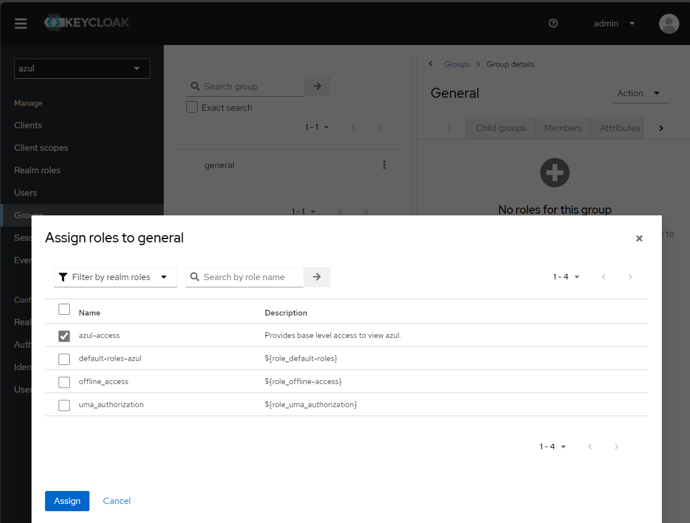

#### Creating users

- Create the following users:
  - `opensearch-admin` - admin user who will be given admin priviledges to opensearch to setup opensearch.
  - `basic` - basic user who can read from Azul and nothing else.
- Add the user `basic` to the group `general`, go to the group `general` (Users -> Add User)
- Add the user `opensearch-admin` to the group `opensearch-admins` and `general`

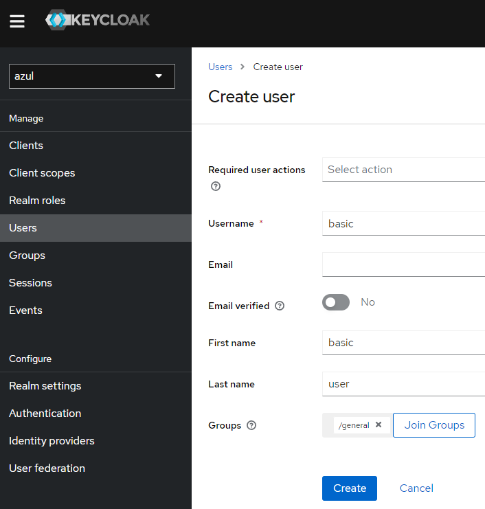

- Create a password for both users by clicking on the user in the user tab and selecting credentials

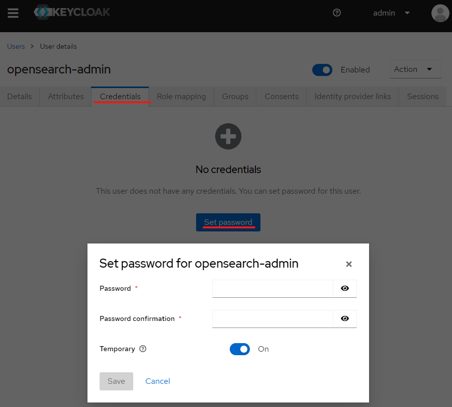

#### Creating client scope and client

- Create client scope `azul`

  - Add a mapper to the client scope select configure new mapper and select the name `user realm role`

  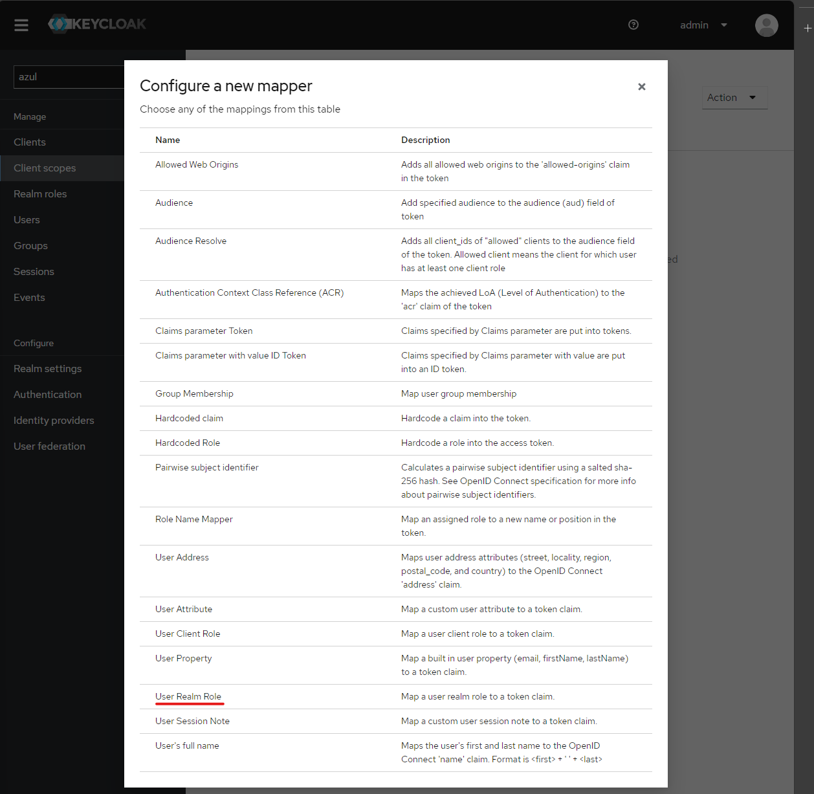

  - Set the name of the mapping to `realm-role-mapper` and the token claim name **MUST** be `roles`

  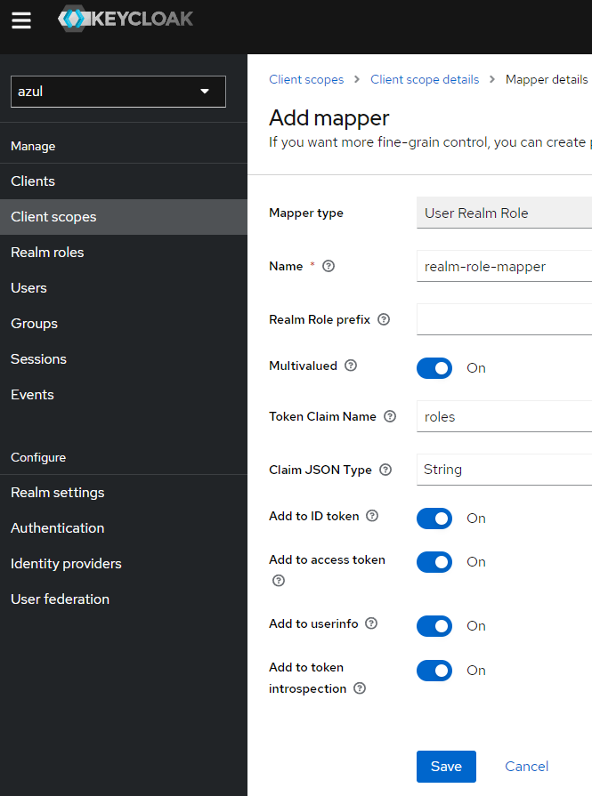

- Create client called `azul-web`

  - Provide the Id and name of the client both `azul-web` and set "always display in UI" to On

  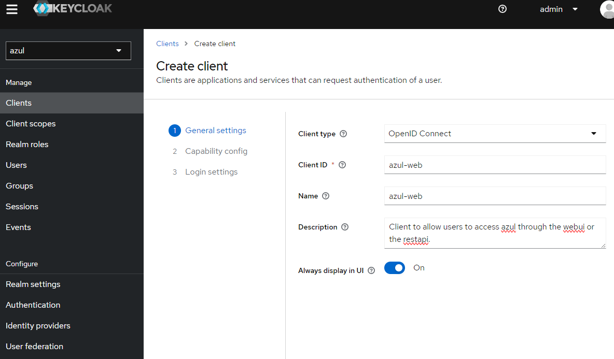

  - Authentication flow is "standard flow" and "direct access grants"
  - Set the following "Login Settings":
    - Root URL: `https://azul.<my.domain>/`
    - valid redirectrs URIs: `https://azul.<my.domain>/*`
    - Web Origins: `+`
  - Save and then add client scope of `azul`.
  - After set Admin URL: `https://azul.<my.domain>/`
  - Navigate to Client scopes and ensure `azul` is present.

  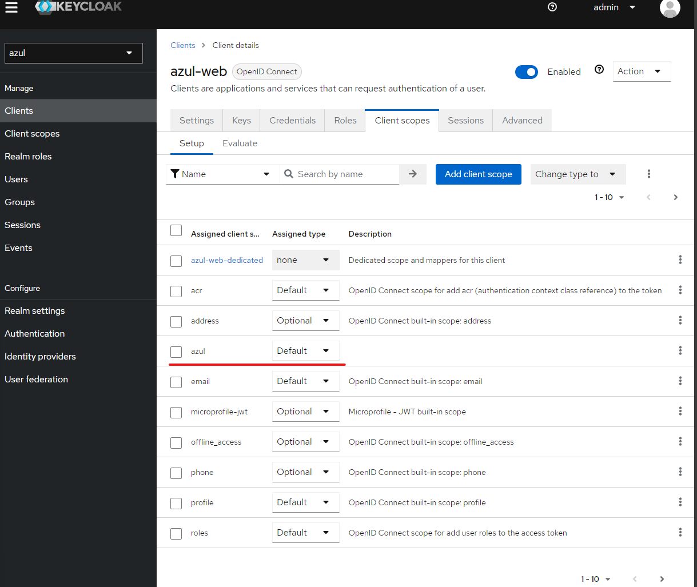

- Create a client scope `audience`

  - Add a mapper to the client scope select configure new mapper and select the name `Audience`
  - Set the name of the mapping to `web-audience` and in Included Client Audience add `azul-web`

  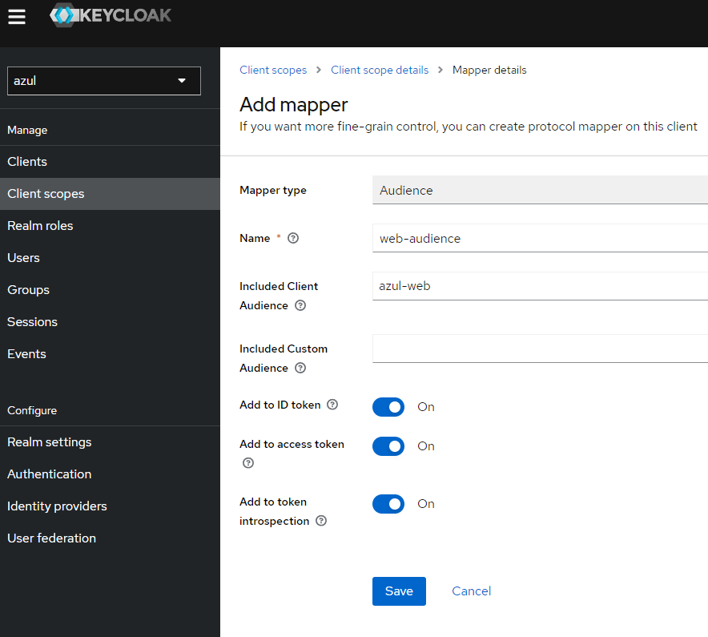

- Add client scope `audience` to client `azul-web`

  - Navigate to the client `azul-web`
  - Go to Client scopes -> Add Client Scope
  - add the audience as a "Default" scope

  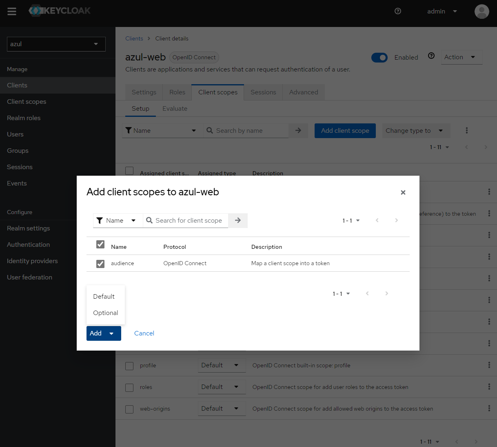

- Create another client called `opensearch-dashboards`
  - Provide the Id and name of the client both `opensearch-dashboards`
  - Enable "client authentication" "Authorization" is off
  - Authentication flow is only "standard flow"
  - Set the following "Login Settings":
    - Root URL: `https://dashboard-opensearch.<my.domain>/`
    - valid redirectrs URIs: `https://dashboard-opensearch.<my.domain>/*`
    - Web Origins: `+`
  - After Save set Admin URL: `https://dashboard-opensearch.<my.domain>/`
  - Navigate to Client scopes and ensure `azul` is present.

### Configuring Azul

In the azul core helm chart the security configuration:

- authority_url - issuer URL found in Realm settings


Security configuration also has the client_id `azul-web` if you've followed the instructions and the scopes which should be `openid profile offline_access roles azul`

```yaml
security:
  oidc:
    enabled: true
    authority_url: https://keycloak.<my.domain>/realms/azul
    client_id: azul-web
    scopes: openid profile offline_access roles azul
```

Once you upgrade/install the helm chart you should be able to login (with the basic user) and see the following.

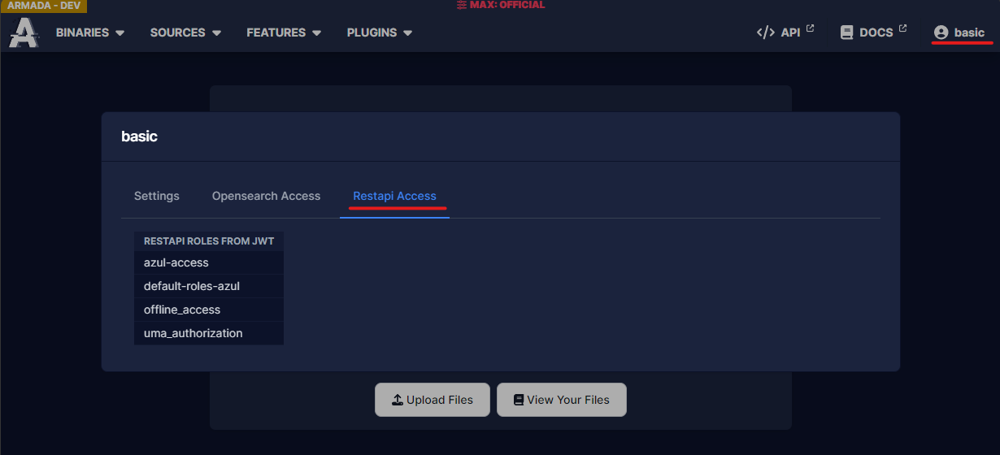

If this isn't close to what you see check the troubleshooting guide.

Azul still won't work yet because you need to setup Opensearch's auth first.
While Opensearch isn't working you will get 500 errors as azul can't contact opensearch.

### optional - Additional security configuration

If you want additional security configuration, e.g you want `REL:APPLE` and `REL:BEE`

And you want certain users to have access to `REL:BEE` and everyone to have `REL:APPLE`

- Create the appropriate realm roles:

  - `REL:APPLE`
  - `REL:BEE`

- Create a new group bees:
- Go to "Role Mapping" and add the `REL:BEE` role

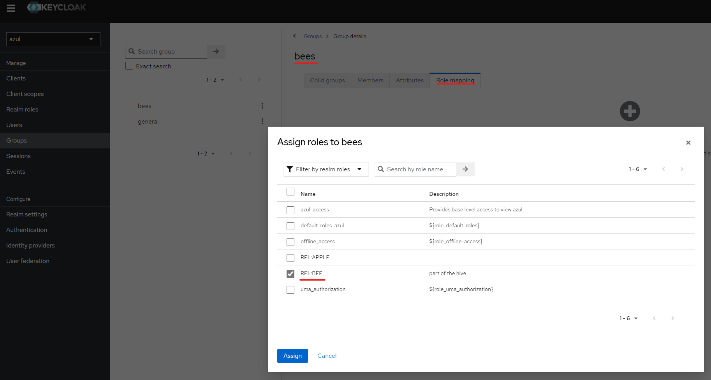

- Go to the group `general` that was created before.
- Go to "Role Mapping" and add the `REL:APPLE` role to that group.

Now if you want users to have `REL:BEE` simply go to "Users" -> "Groups" and assign them the groups you want.

For these permissions to work you will need to map them to roles in Opensearch.

### optional - create a service account

For automated access to the azul api (e.g service account used in azul-plugin-assemblyline)

- Create a client scope called `azul-service-cs`

  - Go to Mappers and "Add Mapper" -> "Configuration"
  - Add "Hardcoded role" and do this for all the roles you want the service account to have:

    - name: `azul-access`, role: `azul-access`

    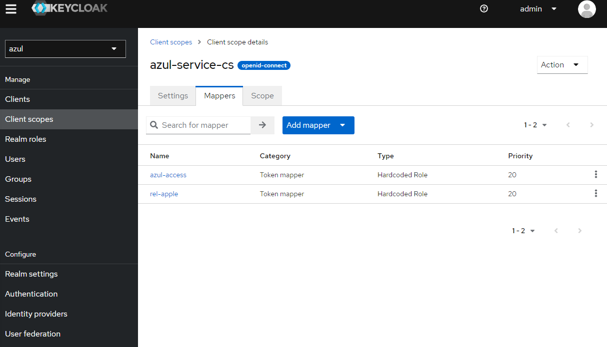

- create a new client `azul-service`

  - Provide the Id and name of the client both `azul-service`
  - Enable "standard flow", "Direct access grants", "service account roles"
  - Set the following "Login Settings":
    - Root URL: `https://azul.<my.domain>/`
    - valid redirectrs URIs: `https://azul.<my.domain>/*`
    - Web Origins: `+`
  - Save
  - Set Admin URL: `https://azul.internal/`
  - Go to "Client Scopes" and add `azul`, `azul-service-cs`, `audience`
    - NOTE: `audience` is the same audience used for the `azul-web` client scope as this is what is needed by Opensearch.

  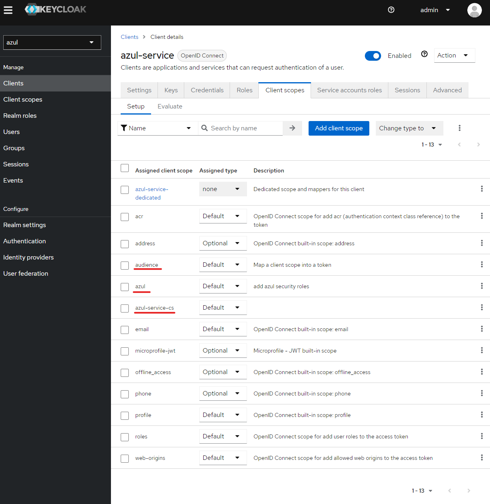

  - Next to use the service account you should get it's client secret on the "Credentials" section"

  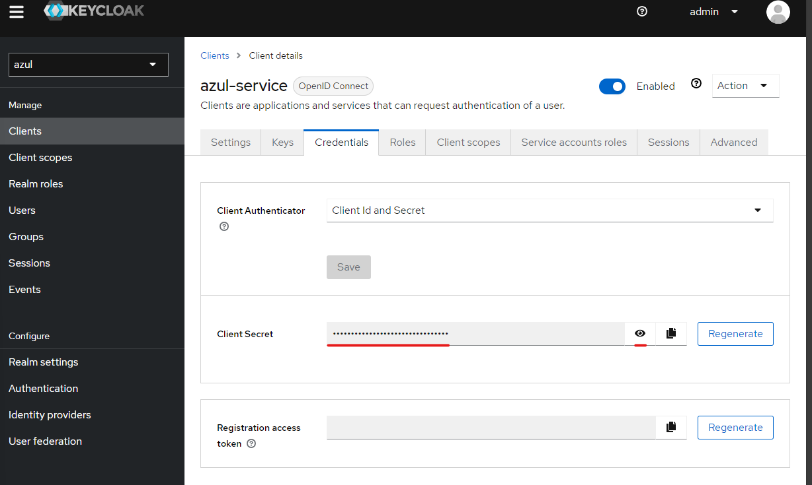

#### test service account

Get the token url from well known configuration which can be found in Realm settings.


```bash
curl -XPOST https://keycloak.my.domain/realms/azul/protocol/openid-connect/token -d "client_id=azul-service&client_secret=password1!&grant_type=client_credentials"
# more generic form of above query
curl -XPOST <token-url> -d "client_id=<client-id>&client_secret=<client-secret>&grant_type=client_credentials"
```

Given the output of the token you can inspect as described in troubleshooting and determine if the token is correct.

You can also setup the azul-client to use the account and verify it works.

Example config (~/.azul.ini file):

```
[default]
azul_url = https://azul-dev.<my.domain>/api
oidc_url = https://keycloak.<my.domain>/realms/azul/.well-known/openid-configuration
auth_type = service
auth_scopes = openid profile email offline_access
auth_client_id = azul-service
auth_client_secret = secretvaluefromthekeycloakui
azul_verify_ssl = False
auth_token = {}
auth_token_time=0
```

## Troubleshooting

#### Token misconfiguration

Once keycloak is configured you should be able to login to Azul and see your user details.
If you can't it will look like this:


If you see this there is probably a misconfiguration in your keycloak token generation.
The best way to check what is going on is to get token and inspect it.

A simple way of doing this is to use the azul-client.
(Alternatively you can use developer tools on a browser and use the azul restapi to auth and look at the token in the response.)

Once you successfully auth check your auth_token value and look at the "access_token".

Then examine the access token, it's in the form:
`<base64-encoded-global-info-about-jwt>.<base64-encoded-user-info-about-jwt>.<other>`

So to examine the roles, aud or other fields you just get the section you want and base64 decode it

The following example uses the service account with this JWT:

```
<section-1>.<section-2 (normally very long)>.<section-3>
```

```bash
echo '<section-1>' | base64 -d
#output:
#{"alg":"RS256","typ" : "JWT","kid" : "xxx"}

echo '<section-2>' | base64 -d
#output:
#{"exp":1709162527,"iat":1709162227,"jti":"3057c094-d1af-4771-ba02-4a7ec9f7e7ba","iss":"https://keycloak.internal/realms/azul","aud":["azul-web","account"],"sub":"3426ae7c-23dc-4372-b08b-cd1216dce47f","typ":"Bearer","azp":"azul-service","acr":"1","allowed-origins":["https://azul-dev.internal"],"realm_access":{"roles":["REL:APPLE","offline_access","uma_authorization","azul-access","default-roles-azul"]},"resource_access":{"account":{"roles":["manage-account","manage-account-links","view-profile"]}},"scope":"openid offline_access azul-service audience azul email profile","clientHost":"127.0.0.1","email_verified":false,"roles":["REL:APPLE","offline_access","uma_authorization","azul-access","default-roles-azul"],"preferred_username":"service-account","clientAddress":"127.0.0.1","client_id":"service-account"}
```

From there you can see what roles you have and compare that to what roles you expect to have.

#### Scope misconfiguration

If you have set the incorrect scopes in your client and try to login to azul you may see Azul
continually refreshing and hitting it's callback API.

The fix for this is to verify your scopes are set as shown in the configuring azul section.
