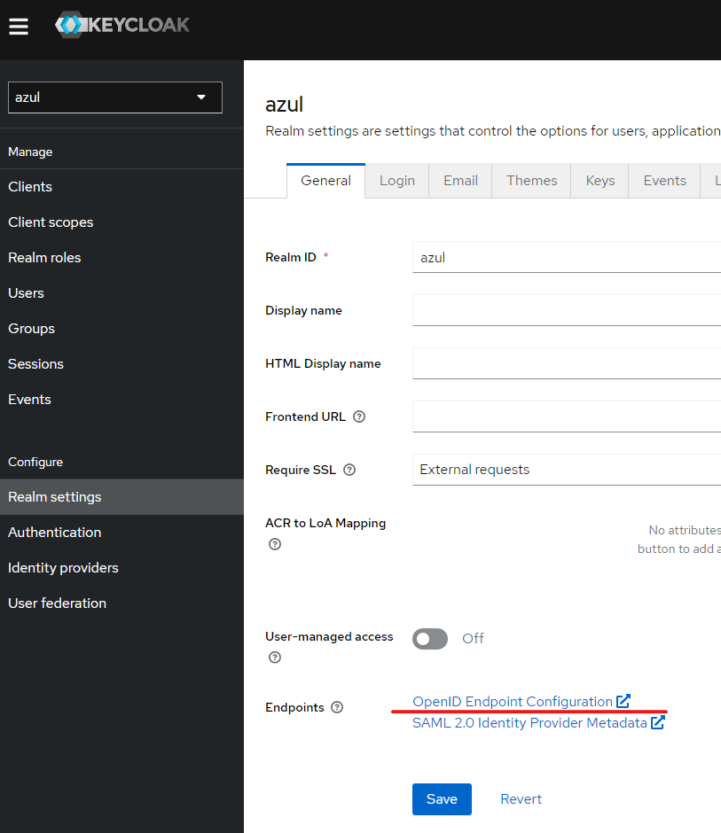
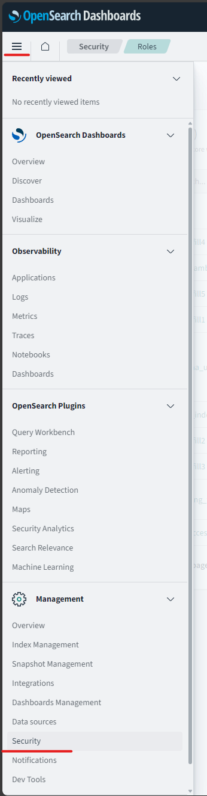
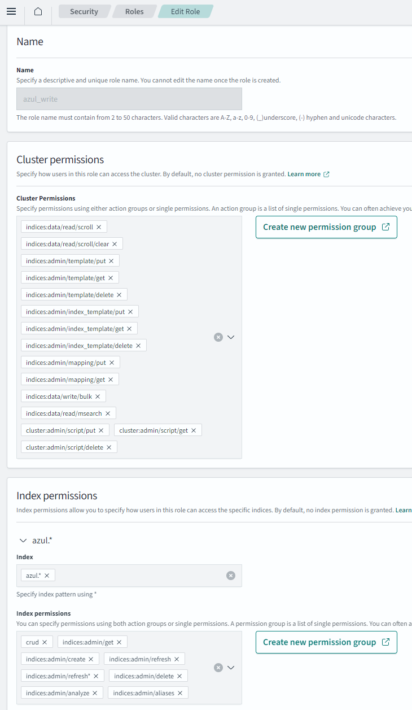
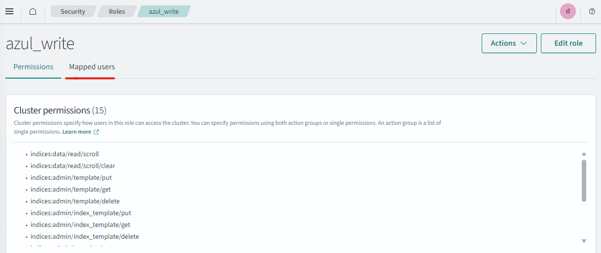
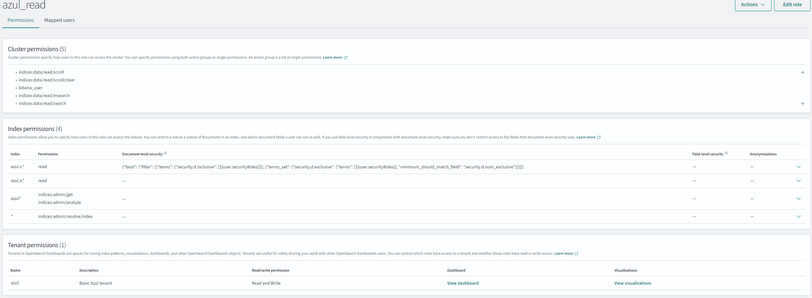
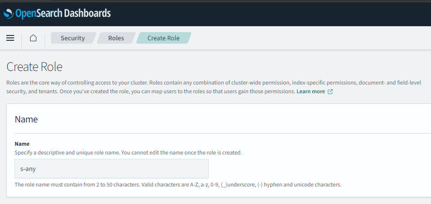
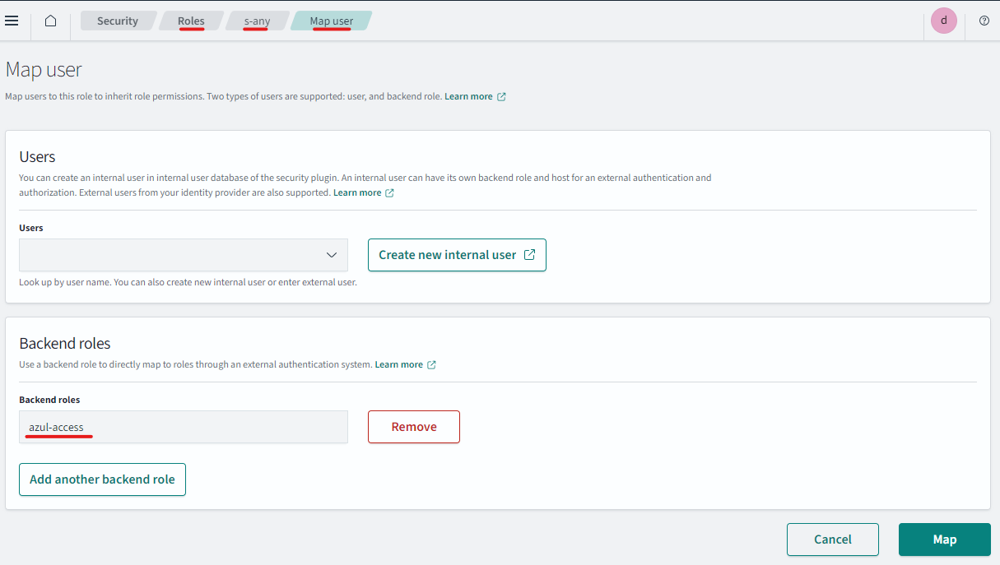
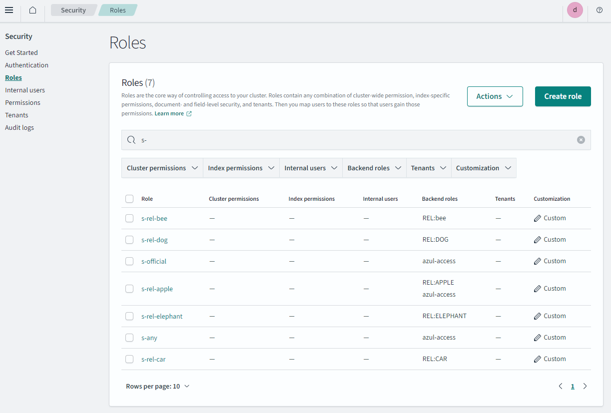
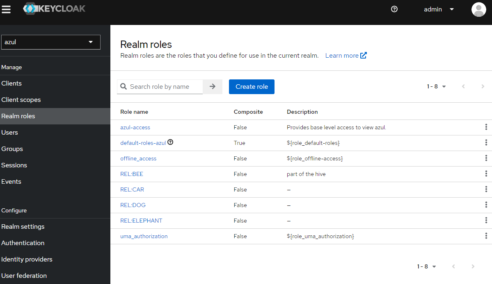
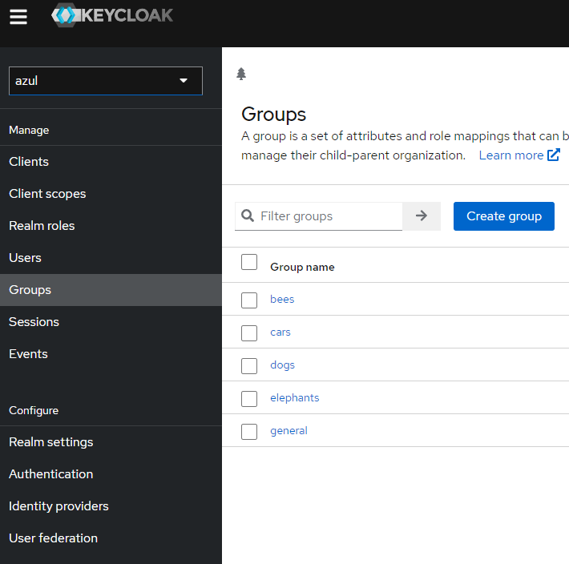

# OpenSearch Configuration

## Install

There is a basic helm chart for deploying OpenSearch for Azul in `azul-app/infra`.

If you simply wish to deploy this chart, please reference the readme within that folder.

Otherwise please reference the chart code and values if you wish to configure your own standalone instance of OpenSearch, especially for the roles and security configuration.

The chart and OpenSearch itself are frequently updated so this readme may grow stale.

At minimum you will need to configure

- azul_writer user
- azul_read -> azul_read rolemapping
- azul_read -> s-any rolemapping
- azul_writer -> azul_write rolemapping
- azul_read role
- s-any role
- azul_write role
- some kind of `authc` security config such as jwt, oidc or basic auth

Current recommendations for configuration is to configure OIDC for OpenSearch and dashboards.

The below is advice for setting up keycloak, please reference `azul-app/infra` for recent changes as well.
Additionally keycloak user interface changes quite rapidly so it may look different.

### OIDC - OpenSearch

[OpenSearch auth OpenID Connect](https://opensearch.org/docs/latest/security/authentication-backends/openid-connect/)

When setting up OpenSearch ensure you map the group `opensearch-admins` from keycloak into OpenSearch's admin section.

Configure OpenSearch config.yml.

Note the url `"https://<keycloak.ingress.dns>/realms/<realm_name>/.well-known/openid-configuration"` can be acquired from the Keycloak realm settings page:


e.g:

```yaml
_meta:
  type: "config"
  config_version: 2

config:
  dynamic:
    # Set filtered_alias_mode to 'disallow' to forbid more than 2 filtered aliases per index
    # Set filtered_alias_mode to 'warn' to allow more than 2 filtered aliases per index but warns about it (default)
    # Set filtered_alias_mode to 'nowarn' to allow more than 2 filtered aliases per index silently
    #filtered_alias_mode: warn
    #do_not_fail_on_forbidden: false
    authc:
      openid_auth_domain:
        http_enabled: true
        transport_enabled: true
        order: 1
        http_authenticator:
          type: openid
          challenge: false
          config:
          subject_key: preferred_username
          roles_key: roles
          openid_connect_url: "https://<keycloak.ingress.dns>/realms/<realm_name>/.well-known/openid-configuration"
          openid_connect_idp.enable_ssl: true
          openid_connect_idp.verify_hostnames: true
          openid_connect_idp.pemtrustedcas_filepath: <path-to-cert-bundle> # NOTE THIS CAN BE A MOUNTED SECRET FROM THE HELM CHART.
        authentication_backend:
          type: noop
```

### OIDC - OpenSearch-dashboard

```yaml
config:
  opensearch_dashboards.yml: |
    server:
      name: dashboards
      host: 0.0.0.0
      rewriteBasePath: false
      ssl:
        enabled: false
        key: /usr/share/opensearch-dashboards/certs/node-key.pem
        certificate: /usr/share/opensearch-dashboards/certs/node.pem

    opensearch:
      ssl:
        verificationMode: "certificate"
        certificateAuthorities: /usr/share/opensearch-dashboards/certs/root-ca.pem
      requestHeadersWhitelist:
      - "Authorization"
      - "security_tenant"
      - "securitytenant"

    opensearch_security:
      multitenancy:
        enabled: true
        tenants:
          preferred:
          - "Private"
          - "Global"
      readonly_mode:
        roles:
        - "kibana_read_only"
      cookie:
        secure: true
      auth:
        type: "openid"
      openid:
        scope: "openid profile email offline_access"
        connect_url: "https://<keycloak.ingress.dns>/realms/<realm_name>/.well-known/openid-configuration"
        client_id: "${CLIENT_ID}"
        client_secret: "${CLIENT_SECRET}"
        base_redirect_url: "https://dashboards.<my.domain>"
```

[Other OpenSearch security configuration](https://opensearch.org/docs/latest/security/configuration/yaml/)

Before starting, ensure OpenSearch has proper 'Backend Roles' configured. Check username -> view roles and identities to check that the keycloak or other oidc roles are coming through correctly.

## Configuration of users and roles

Once OpenSearch is up and running.

### Configuring users

On the OpenSearch Dashboard UI you need to navigate to the security section:



All security configuration occurs here.

### azul_writer

#### User

Creating the azul_writer user.

- navigate to security -> "internal users"
- Create a new user called `azul_writer` and set their password (keep password for azul configuration)
- You will want to map that user to the azul_write role after you create it next.

NOTE: `azul_writer` is used within the system as a unique identifier for caching some of the accesses to Azul.
For all other users the `subject` in their `JWT` is used.

This means that if a user can make their subject be `azul_writer` that user could view data they shouldn't be able to.
Ensure the OAuth system you use doesnn't enable this to occur (user shouldn't be allowed to set their subject.)

#### Roles

- To create the roles and rules correctly. You need to `exec` into a running restapi pod, and run one of the following commands:
  - `azul-metastore apply-opensearch-config` you will be prompted to provide credentials and the roles listed by the command will
  be created in OpenSearch.
  - OR `azul-metastore apply-opensearch-config --print-only` this will provide you with the opensearch command needed to create the
    appropriate roles and importantly also contains the current DLS query that will need to be applied to the `azul_read` user.

- Create a role
- Name it: `azul_write`
- Add the cluster and index permissions
  - Permissions to set should be referenced from `azul-app/infra` (screenshot is out of date).



#### Map role to user

- Reopen the role you just created and select "Mapped users"



- Click manage mappings and unset Users select `azul_writer`

### azul_read role

This role sets up basic index access for regular Azul users, including a DLS query for protecting certain documents.

- Create a role
- Name it: `azul_read`
- Permissions to set should be referenced from `azul-app/infra` (screenshot is out of date).

When complete the role will look like this 

#### Mapping azul_read role to backend role azul-access

- Navigate to security -> "Roles"
- Selected `azul_read`
- Select "Mapped Users" -> "Manage Mapping"
- Add the `azul-access` as a "backend role".


## Required role s-any

`s-any` is a default role that is required for when a document has no inclusive or no exclusive security configuration.

#### Creating and mapping a role

- Go to OpenSearch -> Security -> Roles
- "Create Roles" put in the name of the role `s-any` in this case.



- Select the Role `s-any` click "Mapped Users" -> "Manage Mapping"
- Under Backend Roles add `azul-access`



## Determining and creating security roles

### Get required security roles

**NOTE - you need to have configured the security section of your values.yaml file and deployed azul to do this.**

Obtain a dump of required roles from restapi deployment:

```bash
kubectl exec -it restapi-... -- azul-security
```

Output should look like:

```
's-official': 'OFFICIAL'
's-rel-apple': 'REL:APPLE'
's-rel-bee': 'REL:BEE'
's-rel-car': 'REL:CAR'
's-rel-dog': 'REL:DOG'
's-rel-elephant': 'REL:ELEPHANT'
```

Any 'marking' entries can be ignored unless you have enabled the TLP enforce_security setting.

### Create security roles

These roles have no filters or permissions attached, the important thing is the 'name' of the roles match above step,
and that the correct "backend role" is mapped. Repeat for all required security roles.

So in this case the following "roles" would be created:

- s-official
- s-rel-apple
- s-rel-bee
- s-rel-car
- s-rel-dog
- s-rel-elephant

Note that the backend role will be the name of the "Realm role" from keycloak.
And you can map one "Realm role" to many OpenSearch roles.

Below is a demo mapping:

| OpenSearch role | backend role | Keycloak Group |
| --------------- | ------------ | -------------- |
| s-official      | azul-access  | general        |
| s-rel-apple     | azul-access  | general        |
| s-rel-bee       | REL:BEE      | bees           |
| s-rel-car       | REL:CAR      | cars           |
| s-rel-dog       | REL:DOG      | dogs           |
| s-rel-elephant  | REL:ELEPHANT | elephants      |

For each role create the role and map it as done before for s-any



NOTE: Each of these roles are used within the DLS query
These roles are used within the DLS query set up for the azul_read role.

### Keycloak groups and realm roles for completeness

Here is what the corresponding keycloak realm roles would look like for this setup:



Here is what the corresponding keycloak groups would look like for this setup:



Noting each group has a "Role mapping" to the backend role listed in the table.

## Azul values.yaml

Configure `azul-app/azul` helm chart `values.yaml` as needed to point to your OpenSearch instance.
