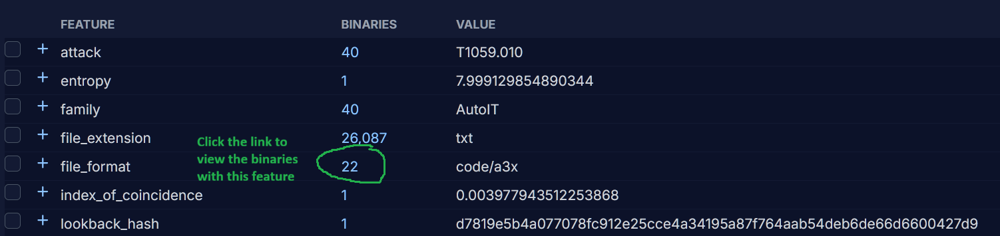
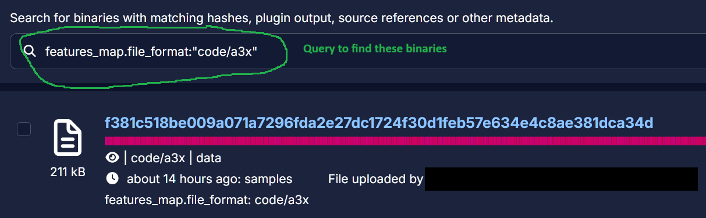
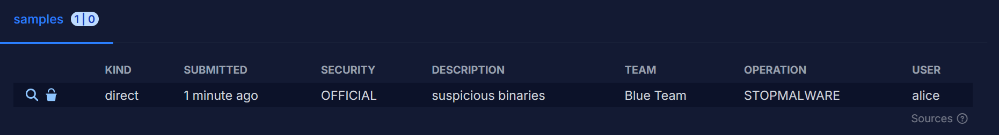
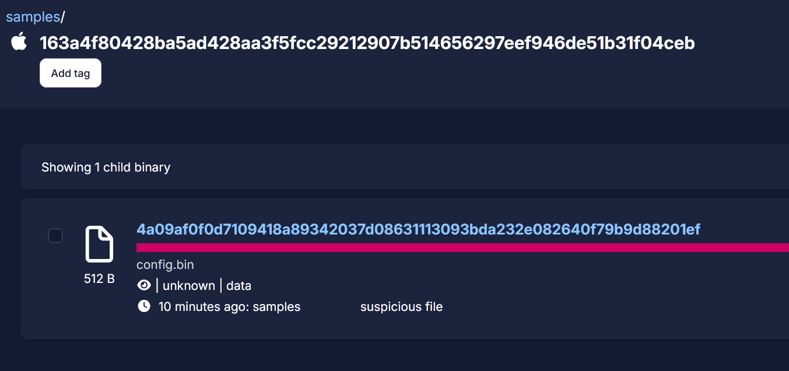
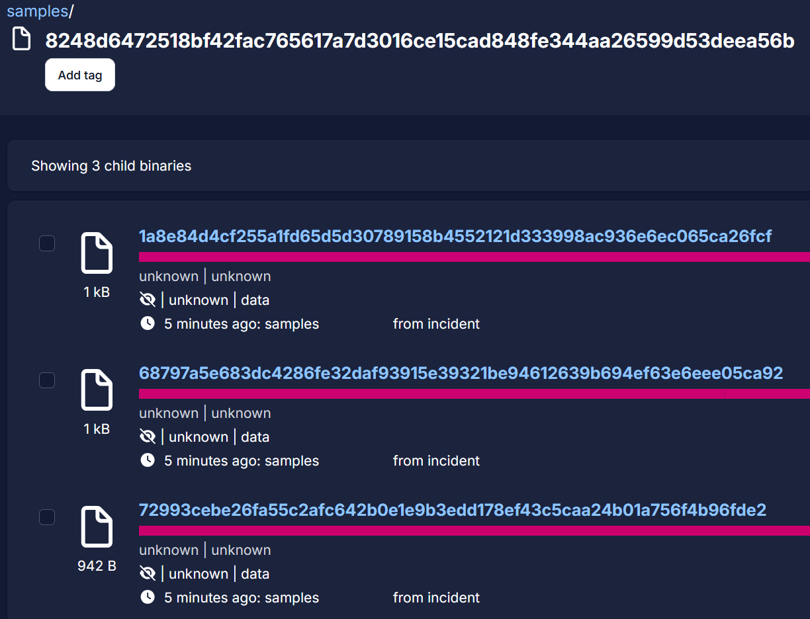

# Azul Client

Azul Client is a command line tool used to interact with an Azul instance, providing an alternative to the web UI.

Its main uses are:

- Downloading samples from an Azul instance
- Uploading samples to an Azul instance
- Querying an Azul instance from the command line
- Querying an Azul instance via Python scripts using the Azul Client API

## Installation

`azul-client` is published to pypi and can be installed via pip:

```shell-session
pip install azul-client
```

## Configuration

Azul Client requires a configuration file, `~/.azul.ini`.  A default version will be created when first running the client.

Once created you should edit the `azul_url` field to point to your Azul instance and set any other authorisation-related configuration options.  See your Azul sysadmin for account setup and authorisation details specific to your Azul instance.

You may store multiple configurations in your configuration file, with each pointing to different Azul instances.  Azul Client requires one of these to be named *default*, which will be used by default when using Azul Client.  The `-c` argument allows you to specify a different configuration:

```shell-session
azul -c testing config view-auth
```

## General usage

The `--help` argument explains sub commands and arguments.

Some arguments also have a shorter form that can be used.  For example, `azul binaries check --help` is equivalent to `azul b check --help`.  Example commands in this document will use the longer form for clarity.

## Querying Binaries

### Binary exists in Azul

The `check` command allows you to confirm whether Azul holds a binary with a given SHA256 hash.

```shell-session
azul binaries check fb7deae7c559731b80b9f896bcd2382ff033c553696edbf17a81eb04121015ae
```

### Data for binary exists in Azul

The `check-data` command allows you to confirm whether Azul holds binary data for a given hash.  Some Azul plugins (such as the VirusTotal plugin) can submit metadata into Azul but not the file content.  Plugins that process the binary data are unable to process the content but the metadata is indexed for searching.

If a binary is present in Azul and Azul holds the binary data for this file:

```shell-session
azul binaries check-data da063af05ad71aaa753ec85c34dd007adb86457d0d271a8e467f4aec573ecf98
...
Binary data available
```

If a binary is not present in Azul or if it is present only as metadata:

```shell-session
azul binaries check-data da063af05ad71aaa753ec85c34dd007adb86457d0d271a8e467f4aec573ecf99
...
Binary data NOT available
```

### Getting hashes or data from binaries

The `get` command allows you to query Azul for binaries and either receive the hashes of matching binaries or download them.  Queries are constructed in the same manner as elsewhere in Azul.  

For example, if a set of binaries all had the tag `new_cluster` then their hashes could be found with:

```shell-session
azul binaries get --term "binary.tag:new_cluster"
```

Multiple Azul plugins can set the same feature.  The following query demonstrates how to download all the binaries that were named as a specific malware family (AutoIT) by any Azul plugin.

```shell-session
azul binaries get --term 'features_map.family:"AutoIT"'
```

If you don't know how to construct a query for the binaries you are seeking, then you can find queries in the Azul web UI.  The web UI displays the queries it uses to query sources, which you can use as terms for download.  For example, to find a set of binaries with a specific feature click on the feature from one binary:



That link will load the set of binaries sharing that feature and also display the Azul query for selecting those binaries:



That query can then be copied and used with the Azul client to access that set of binaries:

```shell-session
azul binaries get --term 'features_map.file_format:"code/a3x"'
```

The default output from `get` queries is a list of hashes.  While Azul Client does have a separate `download` command (see [Downloading samples](#downloading-samples)), you can also download the files from queries issued with the `get` command.  Any files downloaded from Azul will be stored in a neutered format, [CaRT](https://pypi.org/project/cart/).

To download files from a query add the `--output` argument and specify a directory for the files to be written to:

```shell-session
azul binaries get --term 'features_map.file_format:"code/a3x" --output my_samples'
```

The `get` command also allows you to query for single binaries via MD5 or SHA1 hashes:

```shell-session
azul binaries get --term dd005ee966c740a7cf106f2fed5275a5
```

Search terms can return many binaries and are limited by default to 100.  You can specify a different limit with the `--max` or `--limit` arguments.

```shell-session
azul binaries get --term "size:128" --limit 10
```

You can also specify the ordering of the search results.  The `--sort-by` argument lets you select a criteria for sorting the binaries from `_score` (default), `source.timestamp` or `timestamp`.

```shell-session
azul binaries get --term "size:128" --limit 10 --sort-by timestamp
```

Query results are ordered in descending order (newest to oldest binary) by default.  To instead sort results in ascending order (oldest to newest binary) use the `--sort-asc` argument.

```shell-session
azul binaries get --term "size:128" --limit 10  --sort-by timestamp --sort-asc
```

### Viewing binary metadata

The `get-meta` command retrieves the metadata from a binary file in Azul.  The metadata is formatted as a Pydantic model and displays in a viewer with syntax highlighting by default.  This style is controlled by the pretty print option, which defaults to True.

```shell-session
azul binaries get-meta da063af05ad71aaa753ec85c34dd007adb86457d0d271a8e467f4aec573ecf98
```

Disabling the pretty print option instead displays the metadata as json.

```shell-session
azul binaries get-meta da063af05ad71aaa753ec85c34dd007adb86457d0d271a8e467f4aec573ecf98 --no-pretty
```

## Downloading samples

Azul Client can also download samples specified by their hashes:

```shell-session
azul binaries download --output my_samples 41546ea577830c3a69ae6ac71517d42544bbe6545af2ad96c1ad2eea5a60d33c a93854686ffcda38f803a3311a2266f8e9513bbc1c573b2109ca80c19f16c163
```

Here `my_samples` is the directory to store the neutered binaries and the list of sha256 hashes refers to binaries that may be stored within your Azul instance.  If the directory does not exist it will be created.  If a binary with the corresponding hash is not found in Azul then it cannot be downloaded.  Similarly, if Azul only holds metadata for a binary then it cannot be downloaded.

## Uploading samples

Azul Client allows uploading samples, which may be stored in either neutered or unneutered formats.

```shell-session
 azul binaries put 6d2e5c1db2eb18af78a1e2052d96bad7519f89c9a615ca18beaaea478ae74d7c samples --ref "description:test upload" --ref "user:alice" --ref "team:Blue Team" --ref "operation:STOPMALWARE" --security OFFICIAL
```

An Azul instance is usually configured with multiple sources and this example uploads a binary to the `samples` source.  See [Querying Sources](#querying-sources) to learn how to query the available sources configured in your Azul instance.  This source is configured with a mandatory *description* field and optional *user*, *team* and *operation* fields.

The `--ref` argument is used to specify additional metadata key:value pairs used to fill out the fields of a source.  One `--ref` argument is required for each metadata field being supplied.  It is only necessary to provide values for the fields that are mandatory for the specified source and this example could therefore omit any of *user*, *team* or *operation*.

Security is a required field in Azul for all binaries, see [Querying Security](#querying-security) to learn how to query the available security classifications configured in your Azul instance.  Security is used to control whether ot not users can see binaries in Azul.

The optional `--timestamp` argument allows you to specify an alternative submission date in ISO8601 format.  If this argument is not supplied then the time of submission is used.  Either the date or date and time can be specified.  If the specified source is configured to age-off submitted binaries and the timestamp falls within the current age-off window, then the submission will fail because the sample would be automatically aged-off.

Before submission the client will summarise the submission and prompt you to confirm the submission.  You can bypass the confirmation by adding the `-y` argument.



You can also submit multiple files at once within an archive, which must be a *zip* file.

```shell-session
azul binaries put suspicious.zip samples --ref "description:collected during incident" --security "OFFICIAL" --extract
```

If the zip file is encrypted, then the password should be supplied with the submission:

```shell-session
azul binaries put suspicious.zip samples --ref description:"collected during incident" --security "OFFICIAL" --extract-password infected
```

If an incorrect password is supplied, then the encrypted archive will not be unpacked by Azul and the binaries within it cannot be extracted and processed by Azul.

Binaries for upload may also be read in via *stdin*.  This works much the same as uploading a file on disk, except in this case the filename argument specifies the name Azul should use for the uploaded binary content:

```shell-session
cat 158a5c02b639a85153e8a6b652e8202550a923819d5f066a22b04953b33c2f40 | azul binaries put-stdin unknown_dropper.exe samples --security OFFICIAL --ref "description:malware dropper" -y
```

### Uploading Child Binaries

Binaries can be submitted as children of existing binaries in Azul, in order to capture the relationship between binaries.  For example, if the parent binary was a dropper, then the child binary could be a payload dropped to disk or carved from memory.  The `put-child` command allows you to upload binaries that have been extracted from a parent binary as children:

```shell-session
azul binaries put-child --parent 163a4f80428ba5ad428aa3f5fcc29212907b514656297eef946de51b31f04ceb --security OFFICIAL --relationship "action:carved and decrypted" config.bin
```



Child submissions will inherit the source of their parent.  The security classification of children may differ to their parents, if that is desirable.

Multiple children may be submitted within an archive, which may be encrypted:

```shell-session
azul binaries put-child --parent 8248d6472518bf42fac765617a7d3016ce15cad848fe344aa26599d53deea56b children.zip --extract --relationship "action:carved from memory" --security OFFICIAL
```



## Querying Azul

Azul Client can be used to query various aspects of how an Azul instance is configured.

### Azul Plugins

You can list the plugins running in your Azul instance with:

```shell-session
azul plugins list
```

To get detailed information about a plugin, such as the features it can extract and how it is configured:

```shell-session
azul plugins info Python
```

The returned plugin information is also viewable in the web UI by browsing to a plugin and viewing its configuration.

### Querying Sources

You can list the binary sources configured in your Azul instance with:

```shell-session
azul sources list
```

Detailed information about a source can be viewed, which includes a description of what the source contains, any expiration policy, the various references fields that can be attached to submitted samples and whether the fields are required or optional.  To see information about a source:

```shell-session
azul sources info samples
```

This returns a summary of detailing how the source is configured and what metadata it supports/expects.

```shell-session
samples:
Description: Generic source for miscellaneous or uncategorised samples
Submissions Expire After 2 weeks
References:
  name: 'description'
  description: 'Short description of what/why samples collected'
  required: 'True'

  name: 'user'
  description: 'Submitter or point of contact for samples'
  required: 'False'

  name: 'team'
  description: 'Internal team who are the data owners of the samples'
  required: 'False'

  name: 'operation'
  description: 'Any investigation/operation name the samples are collected under'
  required: 'False'
```

To list the full configuration for all sources in an Azul instance in formatted as json:

```shell-session
azul sources full
```

### Querying Security

You can query the security classifications that your Azul instance is configured with:

```shell-session
azul security
```

This returns a list of the configured security classifications that may be applied to submitted binares:

```shell-session
Security Presets:
OFFICIAL TLP:AMBER+STRICT
OFFICIAL TLP:AMBER
OFFICIAL TLP:GREEN
OFFICIAL TLP:CLEAR
```

To list the full configuration for all security presets available on your Azul instance formatted as json:

```shell-session
azul security --full
```

### Querying Azul Client Configuration

You can query your Azul Client configuration, including configured authorisation values and any authorisation secrets, which may assist with debugging authentication issues between your Azul instance and Azul Client:

```shell-session
azul config view-auth --full
```

You can also close any existing authorisation sessions with:

```shell-session
azul config clear-auth
```

## Using the Azul Client API

You can use Python to interact with Azul via Azul Client's API.  This allows you to perform more complex interactions or combinations of interactions with Azul than via Azul Client.

Example script: Download all the children of a given parent hash:

```python
from azul_client.api import Api

import sys

parent_hash = sys.argv[1]

# initialise API instance
azul_api = Api()

child_hashes = []

# check if meta exists
if azul_api.binaries_meta.check_meta(parent_hash):
    # use API to get metadata for hash
    meta = azul_api.binaries_meta.get_meta(parent_hash)

    # get all of the child hashes from metadata results
    child_hashes = [child.sha256 for child in meta.children]

# enumerate all the child hashes and download
for hash in child_hashes:
    # download the actual binary data (cart'ed)
    if content := azul_api.binaries_data.download(hash):
        # write the binary to a file
        with open(f"{hash}.cart", "wb") as f:
            print(f"Writing {hash}.cart")
            f.write(content)
```

Example script: Query a feature (base64 alphabets) and display the frequency of each value observed:

```python
from azul_client import Api

from azul_bedrock.models_restapi.features import ValueCountItem

# initialise API instance
azul_api = Api()

# query features for b64 alphabet values
res = azul_api.features.find_values_in_feature("b64_alphabet")

# enumerate results for feature values
b64_alphabets = [item.value for item in res.values]
# print(b64_alphabets)

# display alphabets and counts
for alphabet in b64_alphabets:
    # build the model for the query params
    feature_value_query = ValueCountItem(name="b64_alphabet", value=alphabet)

    # query Azul
    res = azul_api.features.count_unique_entities_in_featurevalues([feature_value_query])

    # unpack and print results
    r = res["b64_alphabet"][alphabet].entities
    print(f"{alphabet}: {r}")
```
