# Malware Analysis

To assist you with malware analysis, Azul has these major capabilities:

* act as storage for malware and suspicious files, including origin of files, point of contact, etc. to aid malware 
analysts and to share malicious files safely.
* perform automated malware analysis, such as sandbox execution, config extraction and file carving.
* correlate different samples of malware that share similar functionality or c2 information.

In most cases, you can click the '?' icon in the Azul web interface to obtain more information about panels.

## Home

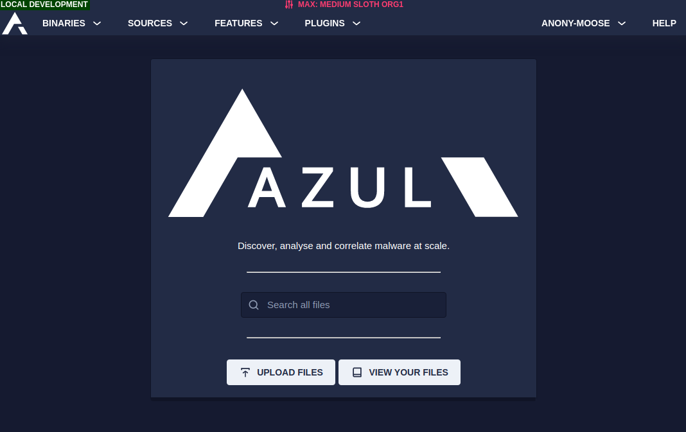

* Links to search, upload and view your uploaded files

## Binary

### Explorer

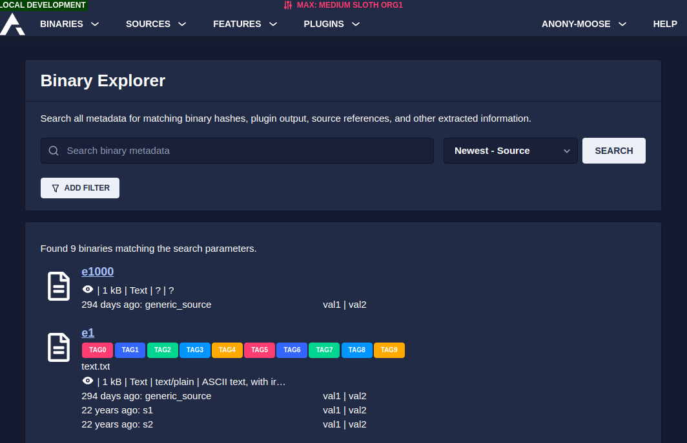

* Use the text box to search for a particular property in Azul.
* Use the 'Add Filter' button to limit your search to a subset of files that must match all of the filters
* Sort results as required
* Up to 50 matches will be found
* You can perform an equivalent search in Kibana to find all matches

#### Maliciousness

While Azul is excellent at extracting metadata across most file types, it does not produce a score or single 
feature to identify whether a file is malicious. Sometimes, it is obvious from specific features but it can 
also be quite difficult to determine and require external context about how a file was utilised.

Azul is focused on being great at extracting features and allowing users to pivot and cluster to similar samples. 
It currently leaves the role of triaging files to external systems or rule engines that can utilise this 
metadata as well as other sources of information to make determinations.

<Quiz 
  question="How might you determine maliciousness?"
  explanation="Azul isn't a triage tool but can assist you in determining this along with some
  of these other tools and techniques. Make sure to consult knowledge stores, use manual analysis
  and contextual insight to gain a better understanding of files."
  options={[
    {answer: "Human reverse engineering of malware with Azul enrichments", correct: true},
    {answer: "Tools like Assemblyline or detonation sandboxes", correct: true},
    {answer: "Double click .exes on corporate", correct: false},
    {answer: "Associating with known bad malware families", correct: true},
  ]} />

### Upload

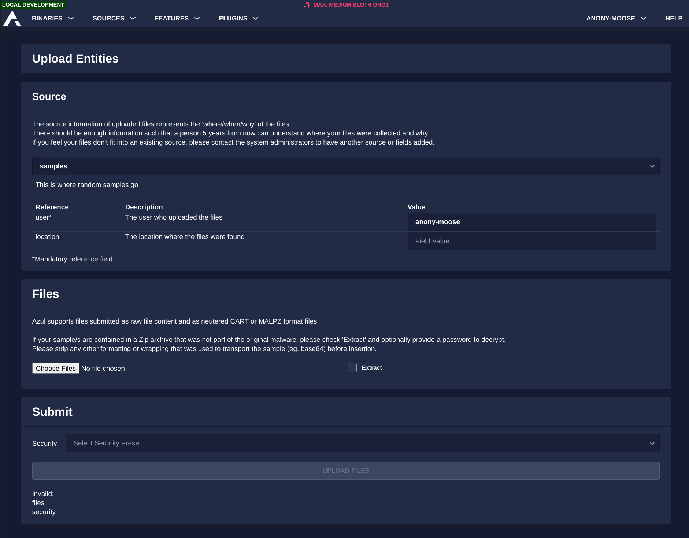

From this page you can upload a small set of samples to Azul into any source.

Check [upload_samples](./upload_samples.md) for more information

#### Notes

If you have a large set of samples, you may want to use the Azul CLI, which doesn't exist (yet).

If you have an ongoing need to automate uploads to Azul, you may want to use the Azul RestAPI to do so. You will 
likely need a service account from the Azul team to fully automate this.

### Tags

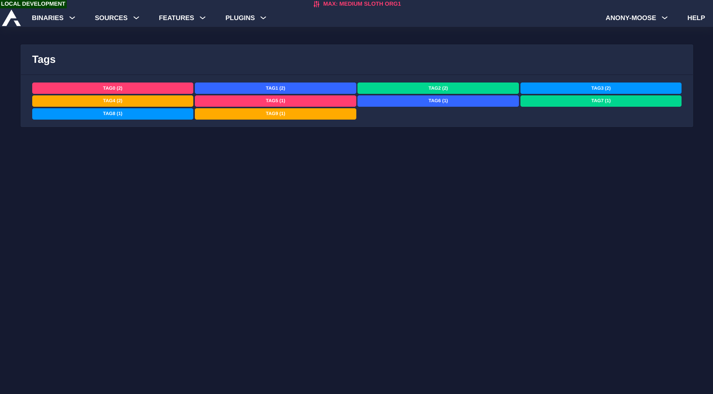

This page will display all tags that are set on binaries in Azul. You can click a tag to be presented with the 
binaries marked with the tag.

### Selected

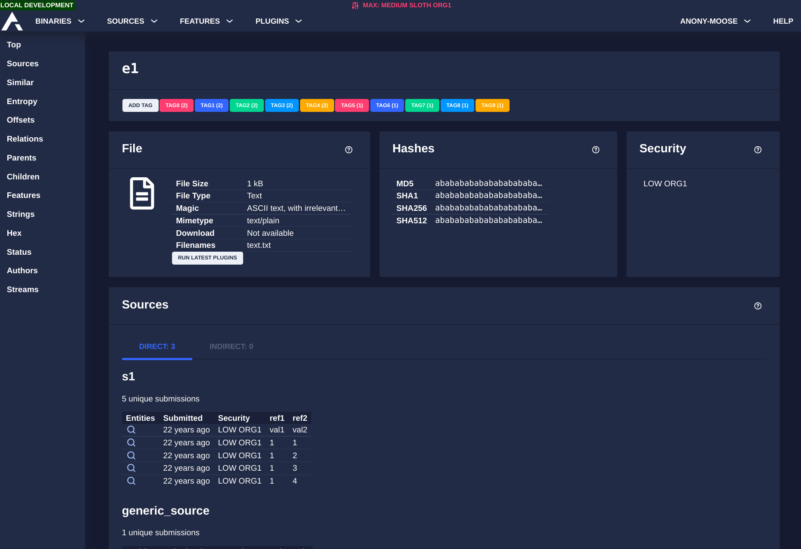

This page will render all known information about the selected binary. Click the '?' icon on a panel to view the 
help text about the panel's content.

## Source

### Explore

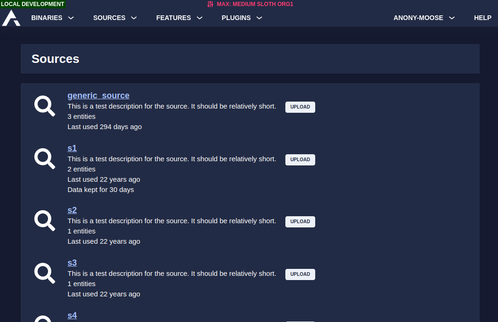

Lists all sources in the system along with the approximate number of entities in each. You can click the upload 
button to add new files to a source, or click the source name to view information about that specific source.

### Selected

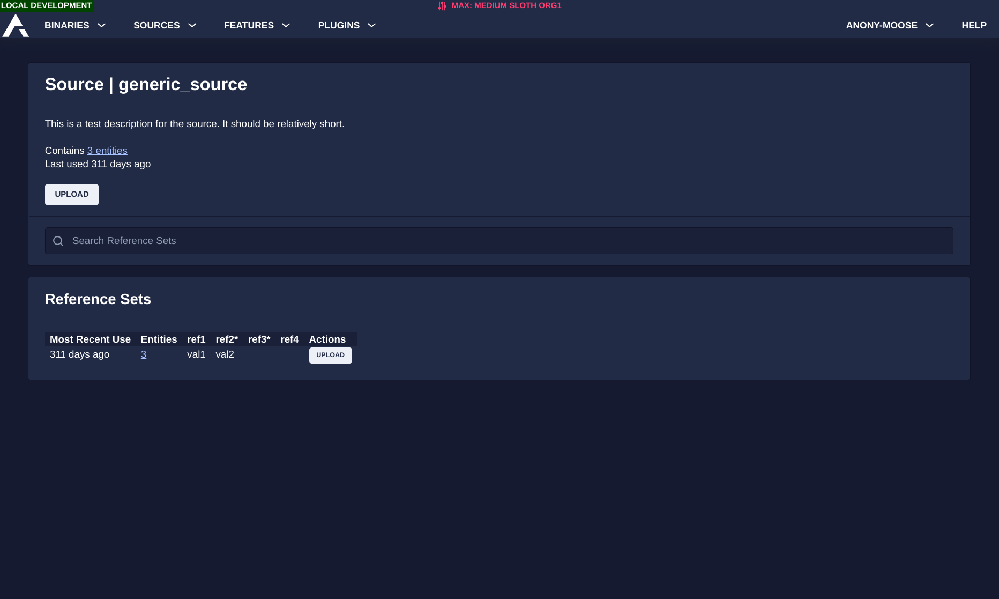

Shows a list of different sets of reference information that was used to upload files. The search bar filters on 
the reference values of the submissions.

Clicking the 'upload' button on a row in the reference sets table allows you to upload to that source with the 
same reference data.

## Feature

### Explore

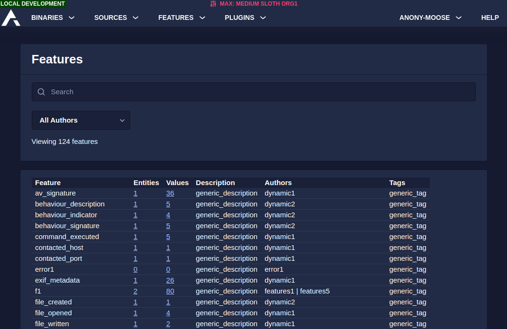

Displays all features that have been registered by Azul plugins, with descriptions and approximate binary and
value counts.

The search function will filter based on the feature name and the description of the feature. You can filter on
an author and version by using the dropdown menu.

Clicking on the binary count will show a list of binaries that produced a value for the feature.

Clicking on the value count will show a list of values for the feature.

### Tags

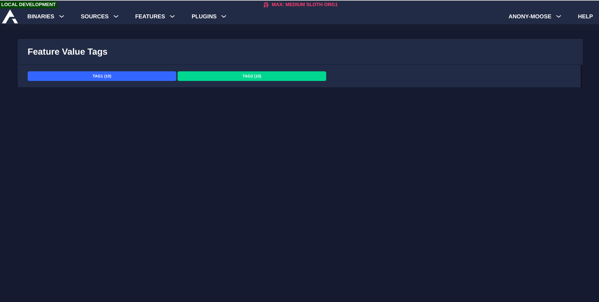

Displays all tags used on feature values. Clicking a tag will allow you to view all feature values that have been 
tagged. You can remove the tags from specific feature values here.

### Selected

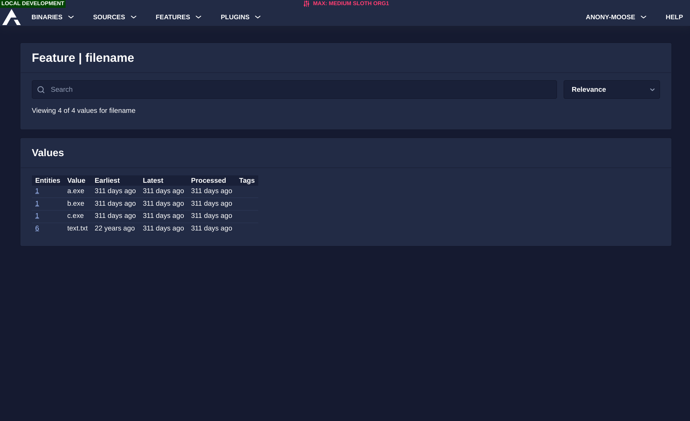

This page shows a list of values produced for the selected feature. You can add and remove tags within this view. 
You can click the binary count to view all binaries with the specified feature value.

## Plugin 

### Explore

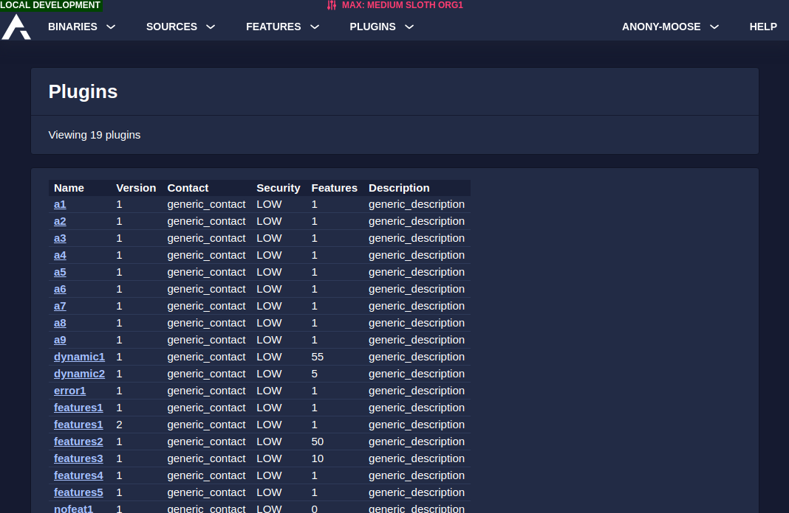

Displays all plugins and all versions of plugins in the system. Click the plugin name to select it for 
further inspection.

### Selected

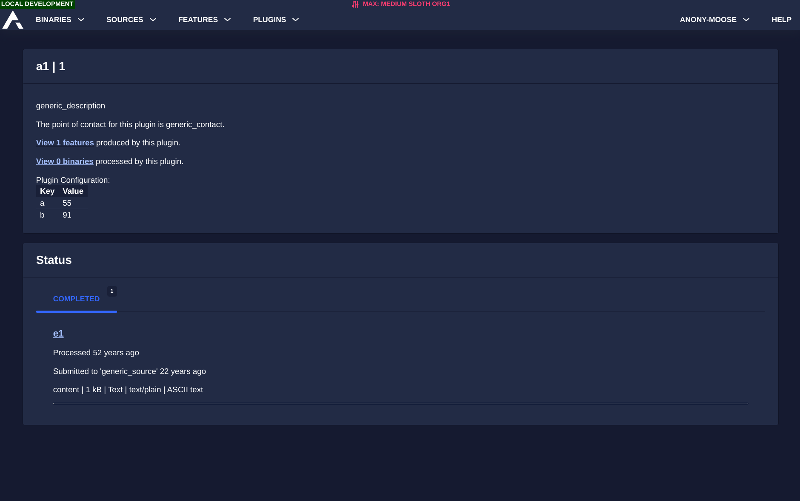

Displays metadata for the plugin including description and configuration.

You can view features produced by the plugin by clicking the link.

You can view binaries processed by the plugin (that produced data) by clicking the link.

Also displays any event messages for the plugin, including error messages.
