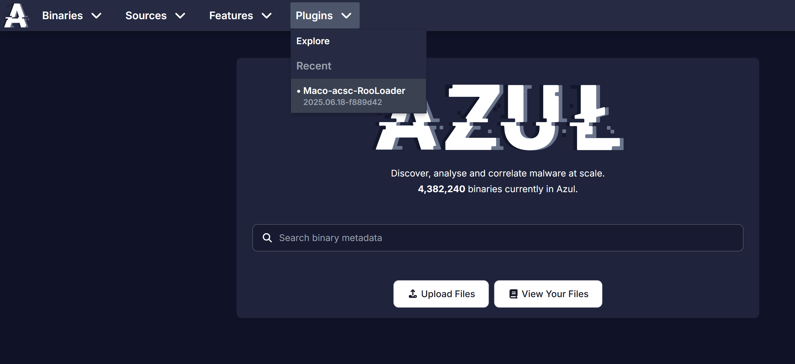
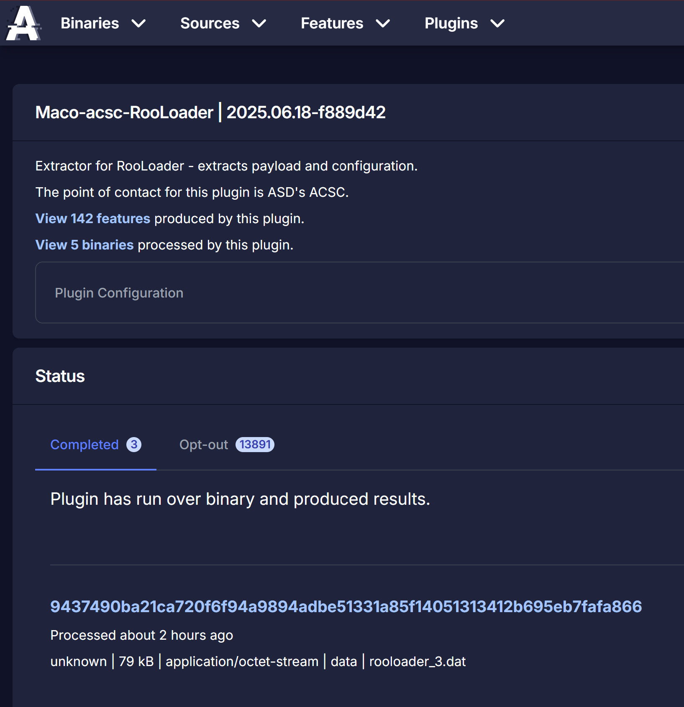
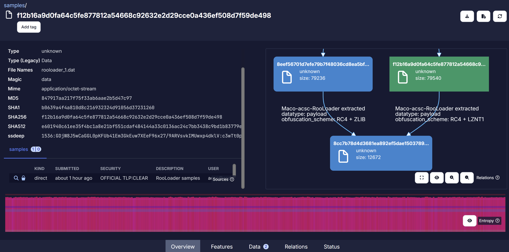
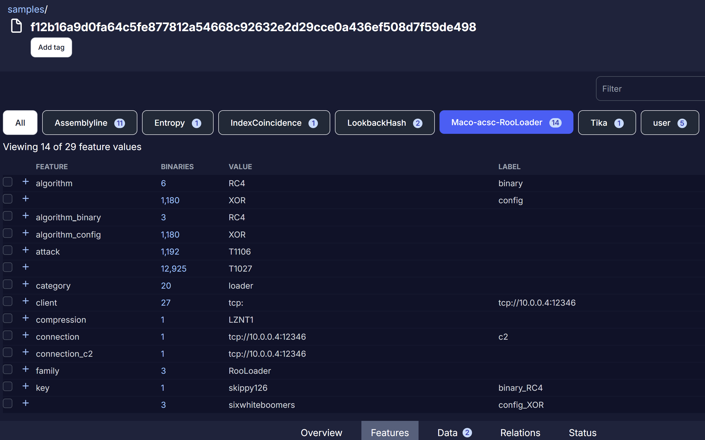
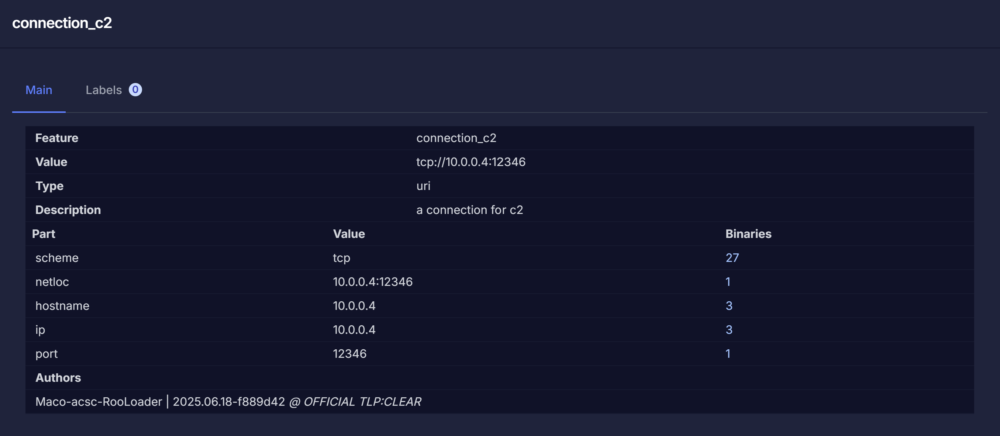
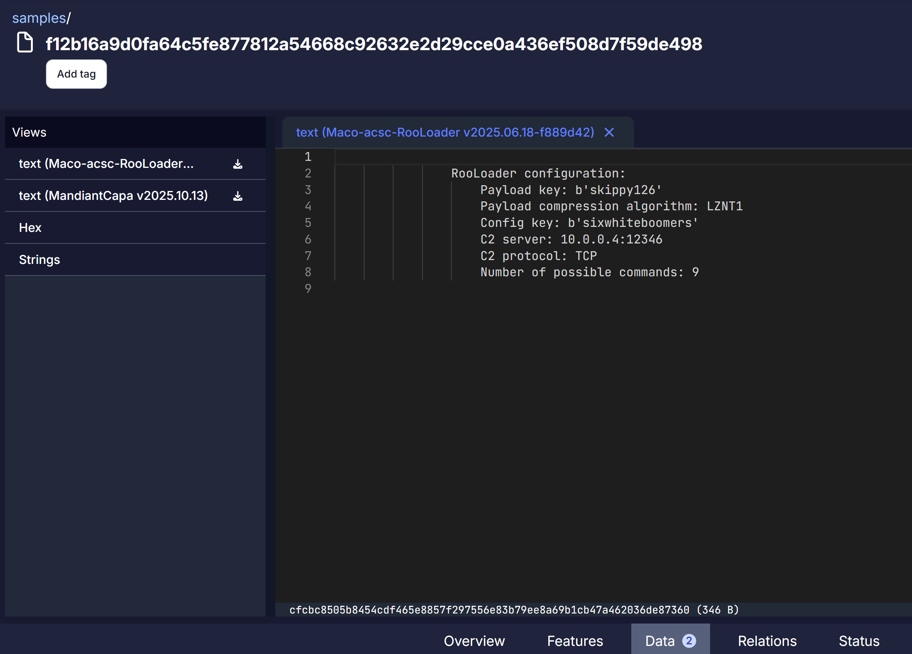

# Writing a Maco extractor plugin

## What is Maco?

Maco is a malware configuration extractor framework, released by the Canadian Centre for Cyber Security. It was built to create a standard model for extracting configuration and payloads from malware samples, with the goal that a standardised framework would make it easier to share extraction logic and automated malware analysis tools. Maco is an installable python package, and can be found on [Github](https://github.com/CybercentreCanada/Maco)

One of Azul's plugins, the Maco plugin, is responsible for running Maco extractors. It uses Maco to run the extractor, then takes the result and maps the Maco model features into Azul features and child files. The Azul Maco plugin can also handle features that are not part of the Maco framework.

## Maco Extractors vs Standalone Azul Plugins

There are a few factors to consider when deciding whether to write a standalone Azul plugin, or a Maco Extractor, which would be run by the Azul Maco plugin. A Maco Extractor is appropriate if the plugin would be designed to extract configuration and/or payloads from samples from a single malware family, or a small group of related malware families. Configuration handled by the Maco model typically relates to Command and Control (C2) and other Indicator of Compromise (IOCs). Writing a Maco extractor can also make it easier to share and reuse in other places, as Maco extractors written for Azul can also be run with any other tools that can run Maco extractors, such as Assemblyline.

If the use case isn't specific to a malware family, or set of families, or only extracts features that are not part of the Maco model, then a standalone Azul plugin would be more appropriate. An example of a standalone plugin is the LiefPE plugin, which parses PE headers, sections, and resources in Windows DLLs and executable files.

Ultimately, either approach is available for extending Azul to process samples in new ways.

## Example Use Case

*Note: the following example uses a hypothetical loader and implant.*

You've finished analysing a new sample - a loader, which you've discovered is part of a malware family RooLoader. RooLoader contains a payload, which is RC4 encrypted. The payload starts with the decryption key (the string "skippy" followed by 3 digits) followed by the size of the payload, and then the payload itself. When RooLoader runs, it decrypts the payload (the implant JoeyRAT) and executes it. RooLoader also contains an encrypted configuration blob for JoeyRAT.

But, when you upload the sample into Azul, it is unable to extract the JoeyRAT payload. You want to extend Azul so that for any future samples of RooLoader, it can automatically extract and decrypt the JoeyRAT payload and the configuration, and insert the JoeyRAT payload into Azul.

Azul is designed to be easily extensible by malware analysts, and the main mechanism to do so is by writing a Maco extractor.

## Writing a Maco Extractor

### Structuring a Maco Extractor

In this example, the extractor consists of two scripts - extract.py, which contains the code to extract all payloads and features from the sample, and RooLoader.py, which contains the code that implements the Maco extractor.

In general, it is good practice to separate out the extraction logic and the Maco logic into separate files. This makes it easier to reuse the extraction logic in other places, in other tools or with other frameworks that don't use Maco. However, a Maco extractor can be written with all the code in a single python file.

When structuring a respository of Maco extractors, the recommended approach is to have each extractor in a separate folder, rather than having all extractors in one folder. This helps prevent name collisions across the extractors.

For example:

```bash
├── maco_extractors/
|   ├── RooLoader/
|   |   ├── extract.py
|   |   ├── rooloader.py
|   ├── CobaltStrike/
|   |   ├──  extract.py
|   |   ├── cobaltstrike.py
```

### Writing the Extraction Logic - Example

The first step is to write the script that will extract all features of interest out of RooLoader samples. This includes the C2 IP and port, communication protocol, the configuration and implant payload encryption keys, and the decrypted implant payload.

```python
from enum import Enum
import re

import struct
from typing import Optional
from Cryptodome.Cipher import ARC4
import lznt1
import zlib

    
class ProtocolType(Enum):
    """RooLoader communication protocols."""
    UDP = 1
    TCP = 2

class CompressionType(Enum):
    """RooLoader compression types."""
    LZNT1 = 1
    ZLIB = 2

class Result:
    """Class to hold the extraction results."""
    payload: Optional[bytes]
    payload_key: Optional[bytes]
    config_key: Optional[bytes]
    c2: Optional[str]
    port: Optional[int]
    protocol: Optional[ProtocolType]
    compression: Optional[CompressionType]
    max_command: Optional[int]


# Payload begins with the key - 'skippy' followed by 3 digits, then 4 byte payload size, then the payload.
PAYLOAD_MARKER = re.compile(rb"(?P<key>skippy[0-9]{3})(?P<size>.{4})", re.DOTALL)

# Configuration constants
CONFIG_OFFSET = 0x400
CONFIG_SIZE = 0x30
CONFIG_KEY = b"sixwhiteboomers"

def decrypt_payload(encrypted_payload: bytes, key: bytes) -> bytes:
    cipher = ARC4.new(key)
    payload = cipher.encrypt(encrypted_payload)
    return payload

def get_payload(data: bytes) -> Optional[Result]:
    result = Result()
    # Find the start of the payload
    match = PAYLOAD_MARKER.search(data)
    if match:
        # Extract the key and payload size from the regex
        payload_size = struct.unpack("<I", match.group("size"))[0]
        encrypted_payload = data[match.end(): match.end() + payload_size]
        result.payload_key = match.group("key")

        # Decrypt the payload
        result.payload = decrypt_payload(encrypted_payload, result.payload_key) 

        return result
    else:
        return None

def get_config(data: bytes, result: Result) -> None:
    config_block = bytearray(data[CONFIG_OFFSET: CONFIG_OFFSET + CONFIG_SIZE])

    # Decrypt the configuration
    for i in range(len(config_block)):
        config_block[i] ^= CONFIG_KEY[i % len(CONFIG_KEY)]
    
    result.config_key = CONFIG_KEY

    # Extract each item from the configuration
    result.c2 = config_block[:0x20].rstrip(b"\x00").decode("utf-8")
    result.port = struct.unpack("<I", config_block[0x20:0x24])[0]
    result.protocol = ProtocolType(struct.unpack("<I", config_block[0x24:0x28])[0])
    result.compression = CompressionType(struct.unpack("<I", config_block[0x28:0x2C])[0])
    result.max_command = struct.unpack("<I", config_block[0x2C:0x30])[0]

def decompress_payload(result: Result) -> None:
    # Decompress the payload and update the payload in the Result class
    if result.compression == CompressionType.LZNT1:
        decompressed_payload = lznt1.decompress(result.payload)
    else:
        decompressed_payload = zlib.decompress(result.payload)
    
    result.payload = decompressed_payload


# Main function
def extract(data: bytes) -> Optional[Result]:
    """Extract the payload and configuration from the RooLoader sample."""
    result = get_payload(data)
    if result:
        get_config(data, result)
        decompress_payload(result)

    return result

```

### Writing the Maco Logic

#### Maco Features

For full details on the features available in Maco, see the Maco [README.md page](https://github.com/CybercentreCanada/Maco/blob/main/README.md).

#### Additional Azul Features

It's possible that malware samples may contain configuration or information that are useful to extract and have as Azul features, but that are not captured by the Maco model.

Non-Maco Azul features can be added under the "other" feature of the Maco model, as seen in the example below. There are some common useful features that have already been included in the Azul Maco plugin (e.g. the "compression" feature in the example below), but any new features must be added to the plugin configuration when the extractor is deployed.

An alternative to defining new features can be to note the extracted information in the report section. This will be displayed in Azul as a text stream. However, if the extracted information is useful for clustering samples, particularly if it is a feature that might be applicable to multiple malware families, it should be included as a feature.

For more detailed information about adding features beyond the Maco model, see [Model Mapping](../../developer-guide/components/plugins/maco/model_mapping.md)

#### Maco Logic - Example

The next step is to write the extractor - a class that implements the Maco extractor, and outputs a Maco model. The Maco extractor will run over any sample that matches the yara rule/s that are defined inside the extractor class.

```python

from io import BytesIO
from typing import List, Optional
from maco import extractor, model
from maco import yara
from maco.exceptions import AnalysisAbortedException

from maco-extractors.rooloader.extract import (
    extract, ProtocolType
)

class RooLoader(extractor.Extractor):
    """Extractor for RooLoader - extracts payload and configuration."""

    family = "RooLoader"
    author = "acsc@asd"
    last_modified = "2025-10-14"
    sharing = "OFFICIAL TLP:CLEAR"
    category = ["loader"]

    """
    T1106 - RooLoader code modules use various API functions to load and inject code.
    T1027 - RooLoader can contain encrypted, compressed/encoded, or otherwise obfuscated code modules
    """
    attack = ["T1106", "T1027"]

    yara_rule = r"""
    rule RooLoader_strings
    {
        strings:
            $ = "skippy"
            $ = "sixwhiteboomers"

        condition:
            filesize < 1MB and all of them
    }
    """

    def run(self, stream: BytesIO, matches: List[yara.Match]) -> Optional[model.ExtractorModel]:
        """Run RooLoader config extraction."""
        
        data = stream.read()
        
        result = extract(data)
        if not result:
            # Failed to extract result
            raise AnalysisAbortedException("Failed to extract config from RooLoader sample")
        
        m = model.ExtractorModel(family=self.family, category=self.category, attack=self.attack)
        
        # Add the encryption features
        m.encryption = [         
            m.Encryption(
                algorithm="RC4",
                key=result.payload_key,
                usage=m.Encryption.UsageEnum.binary,
            ),
            m.Encryption(
                algorithm="XOR",
                key=result.config_key,
                usage=m.Encryption.UsageEnum.config,
            ),
        ]
        
        # Add the C2 comms features
        connection = m.Connection(server_ip=result.c2, server_port=result.port, usage=model.ConnUsageEnum.c2)
        if result.protocol == ProtocolType.TCP:
            m.tcp.append(connection)
        else:
            m.udp.append(connection)
            
        # Add the other features
        features = {"compression": result.compression.name}
        
        m.other = {
            "version": "azul_v1",
            "features": features,
            # Add a report to display a block of text in Azul
            "report": 
                f"""
                RooLoader configuration:
                    Payload key: {result.payload_key}
                    Payload compression algorithm: {result.compression.name}
                    Config key: {result.config_key}
                    C2 server: {result.c2}:{result.port}
                    C2 protocol: {result.protocol.name}
                    Number of possible commands: {result.max_command}
                """
        }
        
        # Add the child binary
        binary = m.Binary(datatype=m.Binary.TypeEnum.payload, data=result.payload)
        
        # Optionally - add additional information to be displayed on the relationship graph in Azul
        binary.other = {
            "version": "azul_v1",
            "relationship": {
                "obfuscation_scheme": f"""RC4 + {result.compression.name}"""
            },
        }
        
        m.binaries.append(binary)
        
        return m
```

## Running the Maco Extractor

### On the Command Line

Any extractor written to be run with the Azul Maco plugin can also be run with the Maco CLI (or with any other tools that run Maco). The following is an example of output from the RooLoader extractor, when run with the Maco CLI:

```bash
acsc@asd:~/maco-extractors$ maco maco_extractors rooloader_sample.dat
RooLoader by acsc@asd 2025-10-14 OFFICIAL TLP:CLEAR
Extractor for RooLoader - extracts payload and configuration.

run RooLoader extractor from rules ['RooLoader_strings']
{
  "family": "RooLoader",
  "category": [
    "loader"
  ],
  "attack": [
    "T1106",
    "T1027"
  ],
  "other": {
    "version": "azul_v1",
    "features": {
      "compression": "LZNT1"
    },
    "report": "\n                RooLoader configuration:\n                    Payload key: b'skippy126'\n                    Payload compression algorithm: LZNT1\n                    Config key: b'sixwhiteboomers'\n                    C2 server: 10.0.0.4:12346\n                    C2 protocol: TCP\n                    Number of possible commands: 9\n                "
  },
  "binaries": [
    {
      "datatype": "payload",
      "other": {
        "version": "azul_v1",
        "relationship": {
          "obfuscation_scheme": "RC4 + LZNT1"
        }
      },
      "sha256": "8cc7b78d4d3681ea892ef5dae1503789a9a2c6580dc40e64cc7e3a236bed450a",
      "size": 12672,
      "hex_sample": "E0A38BC54F1A83164692E6BE35F31283A8AC8B618BF47CF5CE98CF92AFD67B9C"
    }
  ],
  "tcp": [
    {
      "server_ip": "10.0.0.4",
      "server_port": 12346,
      "usage": "c2"
    }
  ],
  "encryption": [
    {
      "algorithm": "RC4",
      "key": "skippy126",
      "usage": "binary"
    },
    {
      "algorithm": "XOR",
      "key": "sixwhiteboomers",
      "usage": "config"
    }
  ]
}

1 analysed, 1 hits, 1 extracted
```

### In Azul

#### Deploying a Maco Extractor with the Azul Maco Plugin

See the Azul Maco plugin [README.md](../../developer-guide/components/plugins/maco/README.md)

#### Viewing Plugin Results in Azul

After deploying the new extractor to Azul and uploading some RooLoader samples, the RooLoader extractor plugin page can be found by navigating through the Plugins menu -> Explore, or under the Recent section.



The plugin page for the extractor shows a feed of the samples that have been processed by the plugin, as well as the ones that have opted out. If a sample matches any yara rules specified in the RooLoader maco extractor, then the RooLoader extractor should process it. Otherwise, it should opt out. This page also lists the features that can be produced by the extractor. However, this list of features is the full list of features that can be produced by any maco extractor run by the Azul Maco plugin, rather than specifically the features produced by the RooLoader extractor.



Looking at one of the RooLoader samples that was processed by the RooLoader extractor, the relationship graph shows that the RooLoader extractor was able to extract and decrypt the implant payload (hash beginning with 8cc7b7...), which was encrypted with RC4 and compressed with LZNT1. The relationship graph also shows that the same implant was also extracted from another RooLoader sample (hash beginning with 8eef56...), but that in that loader, the implant was compressed with ZLIB instead.



Under the Features tab, selecting the RooLoader extractor tab will display only the features produced by the extractor. It displays the feature names, the value, and the number of binaries in Azul with that feature value. Clicking on those feature counts brings up a list of those binaries, to enable pivoting.



Clicking on the "+" icon beside each feature name brings up additional information about that feature. Under the connection_c2 feature, it breaks down the C2 value of "tcp://10.0.0.4:12346" into the component parts, to enable pivoting off each component. While this sample is the only binary in Azul with that protocol/host/port combination, the connection_c2 page reveals that there are two other binaries in Azul with the same host ip.



The report text can be viewed under the Data tab.


