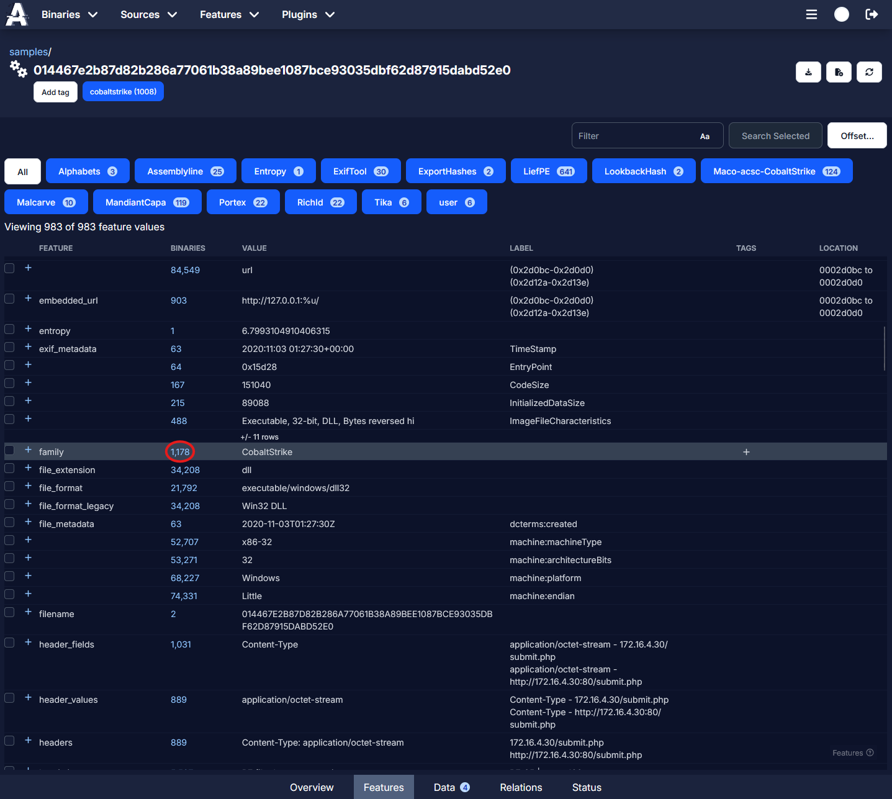
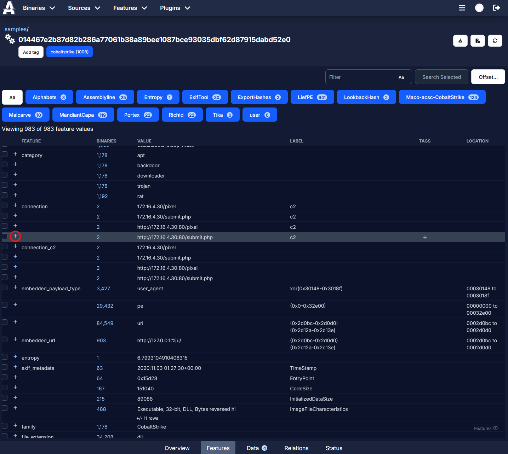
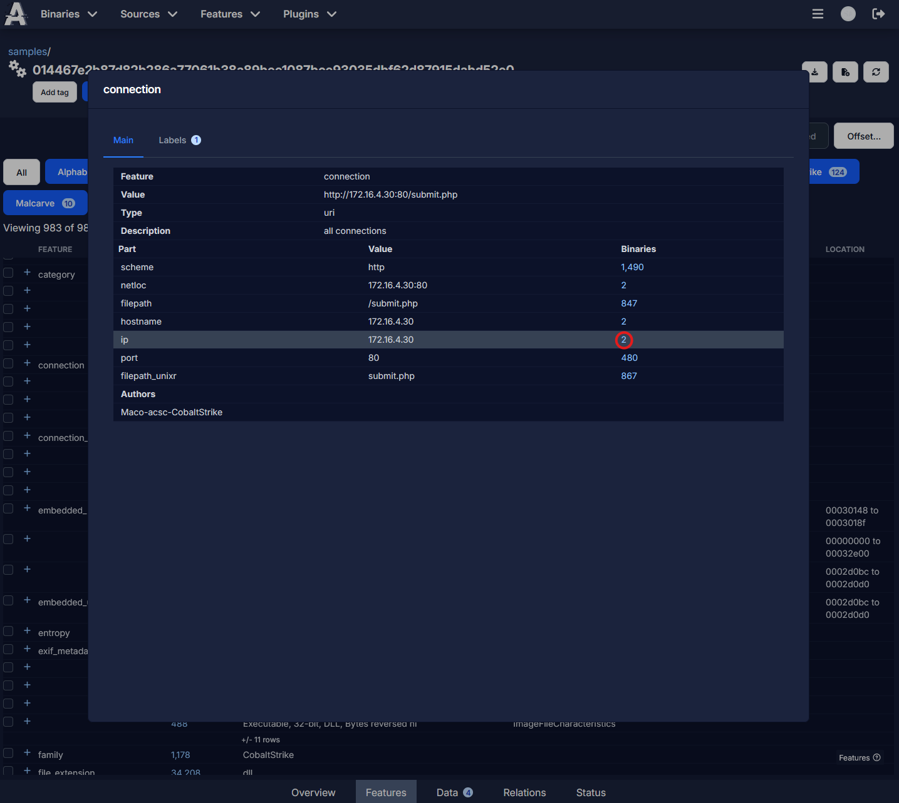
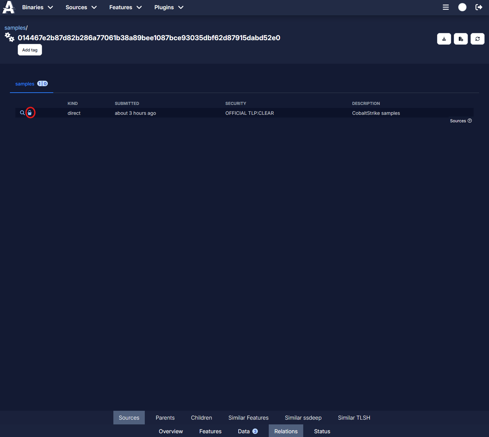
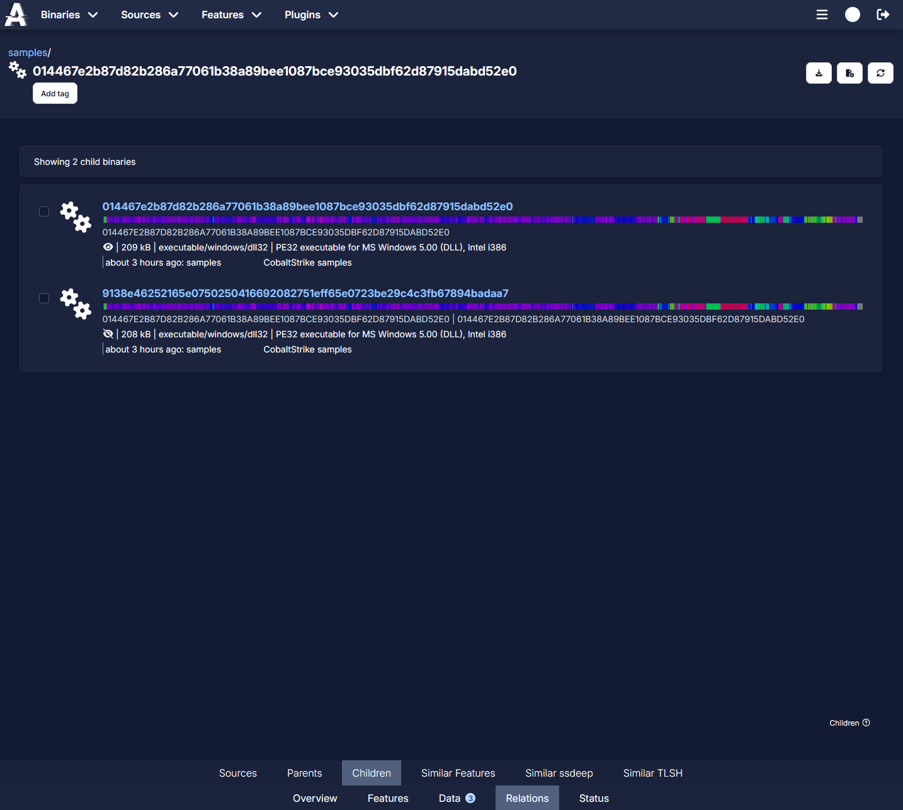
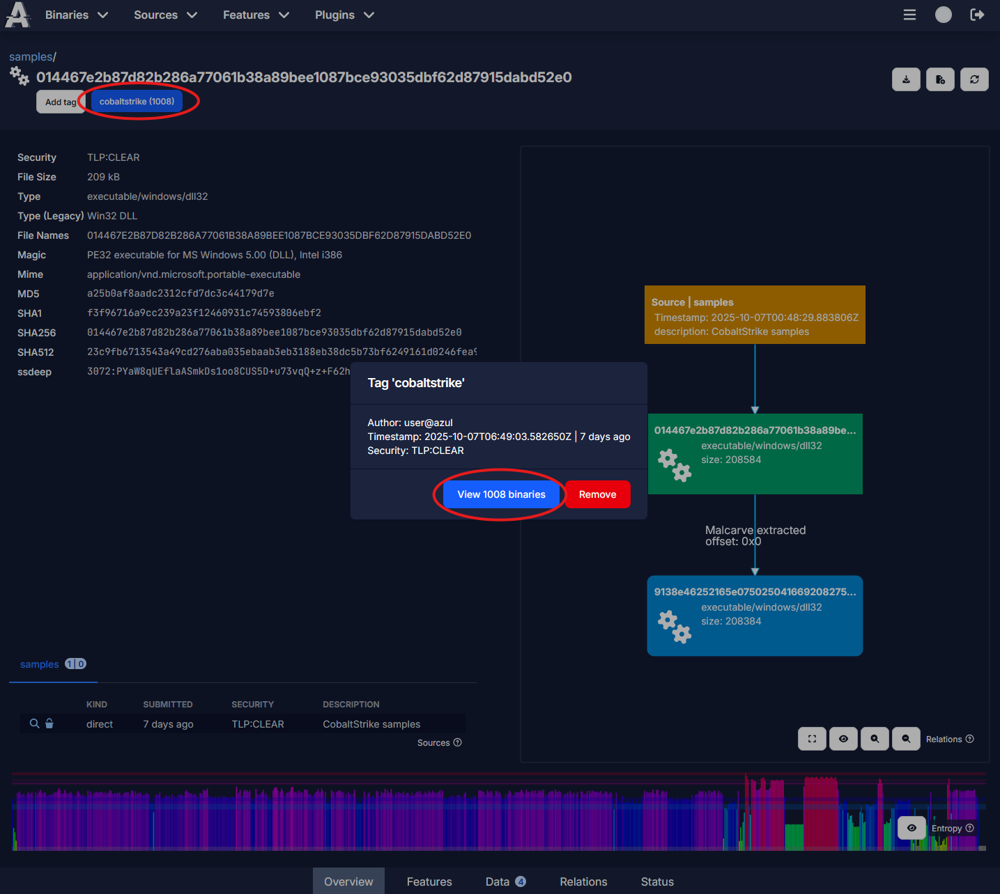
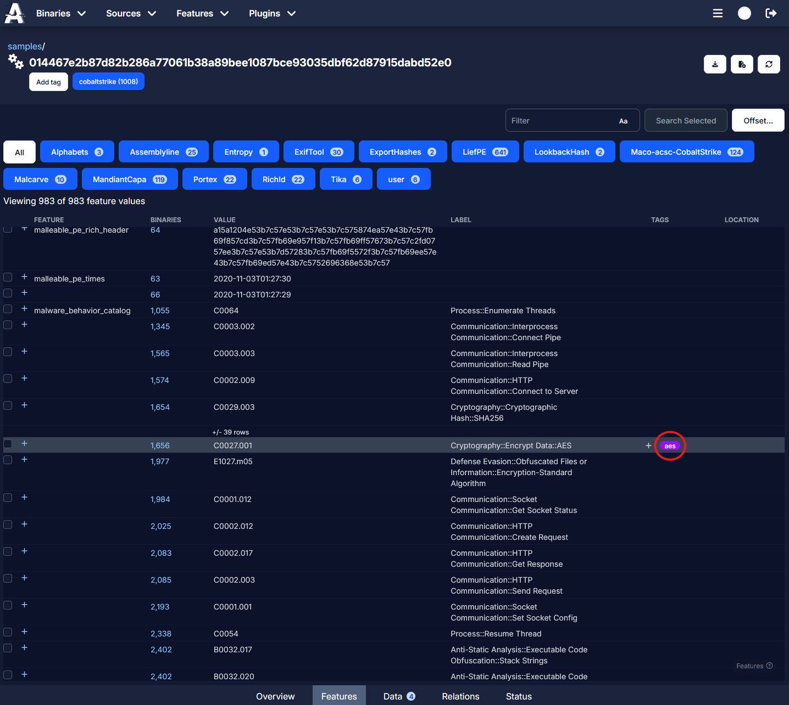
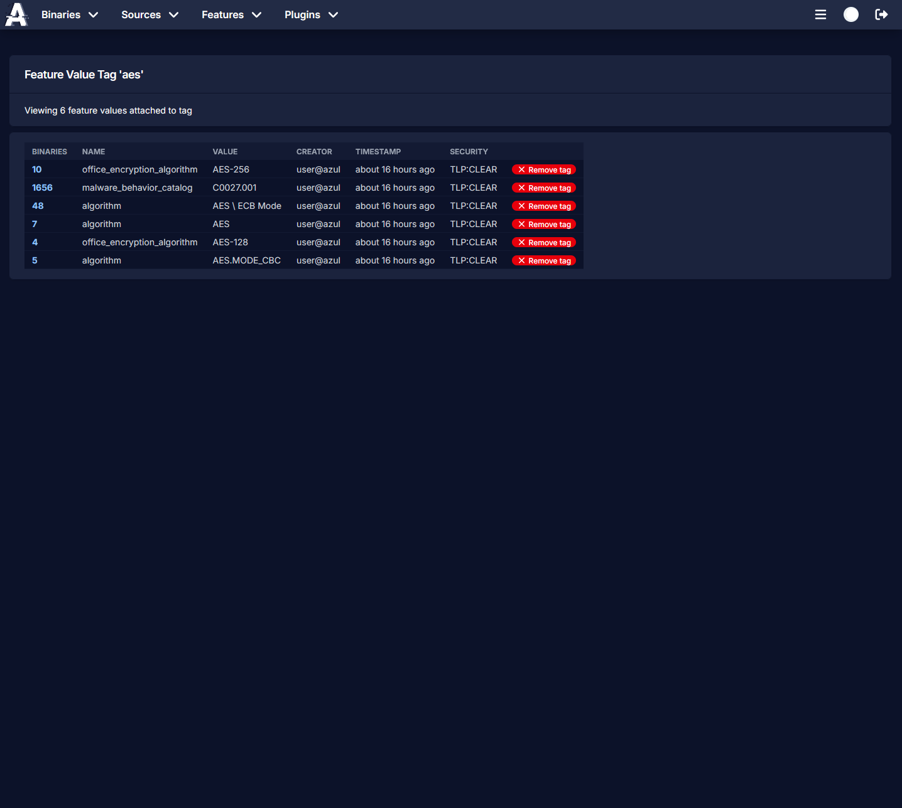

# Pivoting on Samples

Azul allows you to pivot onto similar samples through features, relations and tags. For more complex pivoting and hunting you can also use Azul's Retrohunt interface.

## Features and Feature Values

When viewing a binary's feature page, you can pivot onto other binaries in Azul which share the same feature and feature value by clicking on the feature count.

### Feature Parts

Some features in Azul, such as filepaths and URIs, are parsed and split into feature parts. These parts can also be pivoted on by clicking the `+` button for the feature, then similarly to feature values, clicking on the count number. This will show all binaries in Azul which have this feature part, meaning that binaries with only partially matching filepaths or URIs are able to be pivoted onto.

## Relations

When viewing a binary's relations page, you can pivot onto other binaries in Azul which were uploaded to the same source, other binaries which also share your current binary as a child (parent binaries), or child binaries of your current binary. <!-- say something about similarity here -->

## Tags

Tags can be manually added and removed by users. They are global and can be seen and removed by all Azul users. You can view all binaries with a certain tag by clicking on either the tag on the binary, or on the feature and feature value pair.

