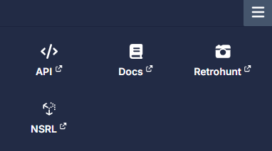
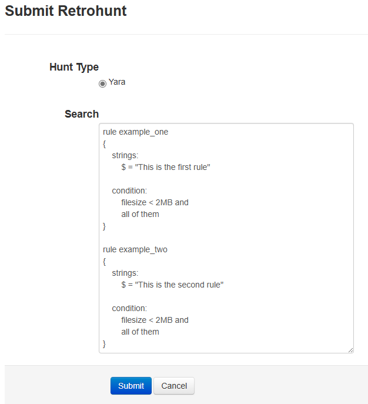
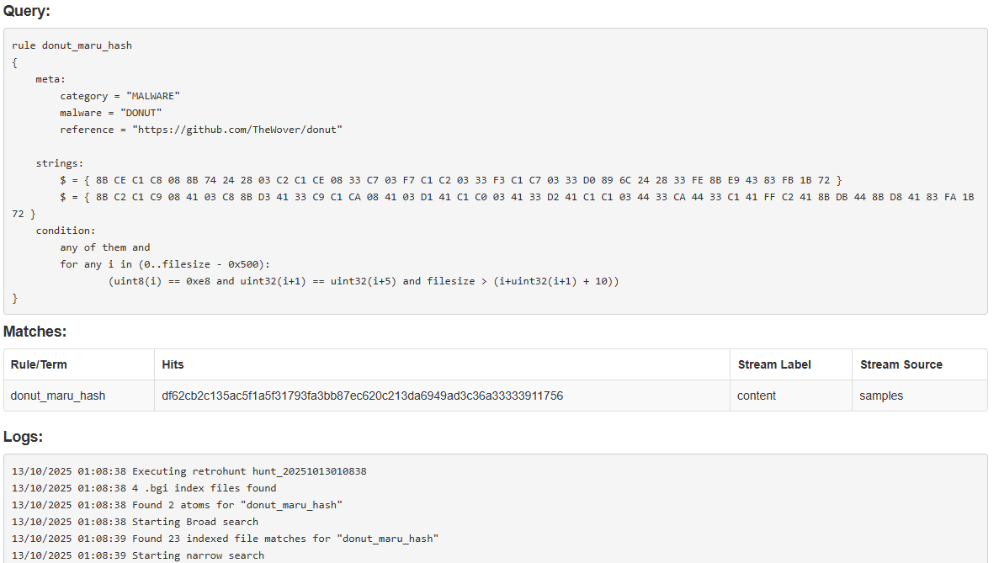

# Retrohunt

Azul supports hunting for binaries in Azul using Yara rules. The Retrohunt interface allows users to submit Yara rules to be run over all binaries in Azul and returns results of any matches.

:::info
Binaries in Azul which do not have content will not be searchable through Retrohunt, as BigGrep indexing requires binary content to narrow the search space before Yara can obtain a match.
:::

Retrohunt is available via the hamburger menu in the toolbar:

## Retrohunt Interface

### Historical Results

This page displays the last 100 currently running and previously submitted retrohunts, with a summary of and link to their full results.

### Submission Page

Yara rules can be submitted via this page for retrohunt processing. Multiple rules can be submitted concurrently.

### Results Page

The results page will continually update while a retrohunt is running until it is completed.

Summary information includes:
    - **Submitted**: What time the retrohunt was submitted
    - **Hunt ID**: The ID of the retrohunt
    - **Status**: The status of the retrohunt. This can be:
        - starting
        - parsing-rules
        - searching-wide
        - searching-narrow
        - completed
    - **Last Update**: When the results page was last updated
    - **Duration**: How long a retrohunt has been running (if in progress) or how long it took to complete (if finished)

Progress information includes:
    - **Rule Parsing**: How many yara rules have been parsed out of the query.
    - **Atoms Found**: How many string atoms were generated.
    - **Index Searches**: How many BigGrep indices atom searches have been completed (the total should be `#atoms * #indices`).
    - **Indexed File Matches**: How many candidate files were found in a BigGrep search.
    - **Yara Searches**: How many candidate files Yara has run over. This may be smaller than indexed file matches if content was previously indexed but is now missing or unavailable.
    - **Yara Matches**: How many successful yara matches were found.

Successful matches will be displayed in a table before the Query text. This information includes:
    - **Rule/Term**: The name of the Yara rule which generated the hit.
    - **Hits**: The SHA256 hash of the file match.
    - **Stream Label**: The label associated with the submission.
    - **Stream Source**: Which Azul source this file was submitted under.

Logging output is available for each retrohunt. If the log data becomes too large, it will be truncated before it is displayed.

### API Docs

The Retrohunt Server supports interactions via various API endpoints which are documented here.

## How Retrohunt Works

### Services

Retrohunt in Azul consists of 4 main services:

#### Ingestor

This service ingests binaries from Azul and prepares them for indexing

#### Indexer

This service indexes files using Cert's BigGrep indexing. File indices are then made available to the Worker service.

#### Worker

This service waits for retrohunt events to be dispatched to it. When an event is received, it will do a wide search across BigGrep indices and then do a narrow search with yara rules over any candidate files. Results are posted back to the dispatcher.

#### Server

This service accepts yara rules from users and will dispatch events to the Worker service(s) to run. Results and search status' are displayed/returned to users.

### Searching

Searching via retrohunt is performed in three main phases:

#### Parsing Rules

This involves breaking down yara rules into string atoms for searching. Modifiers applied to strings will increase the amount of atoms, for example the `wide ascii` modifier will produce two atoms per string.

#### Wide Search

This involves doing an atom search over BigGrep indices in order to find candidate files which match atoms and are therefore more likely to hit on yara rules. Performing this step to pre-filter candidates before running Yara is more performant on larger corpus' of data and therefore preferable to simply running yara over everything.

#### Narrow Search

This involves directly running yara rules over candidate files.

## Limitations

- Due to the use of string atoms to pre-filter candidates via BigGrep indices, yara rules submitted to Retrohunt must contain strings
  - At least one string per rule needs to contain a minimum amount of sequential *fixed data* in order to perform an atom search. This value is configurable but is set to 3 bytes by default.
