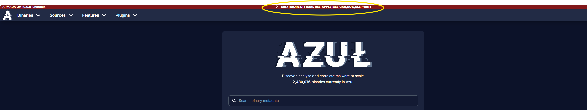
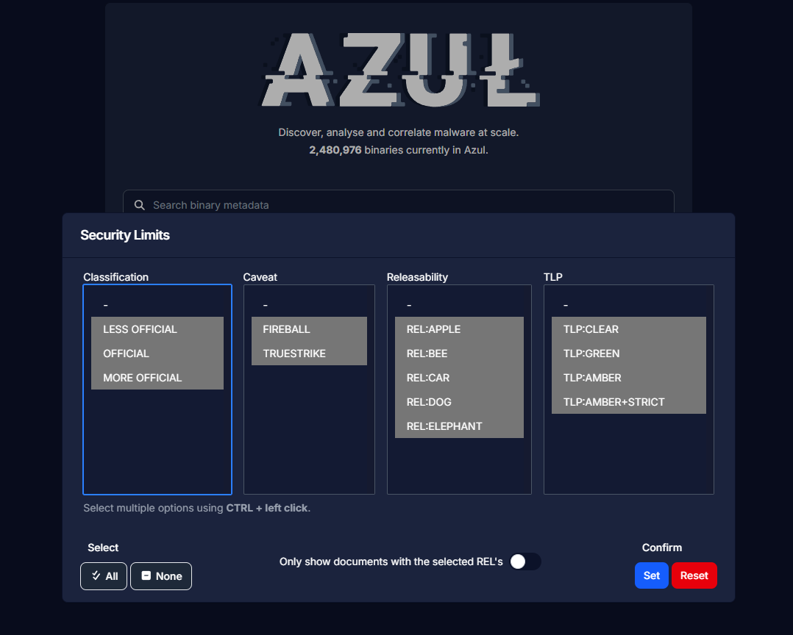
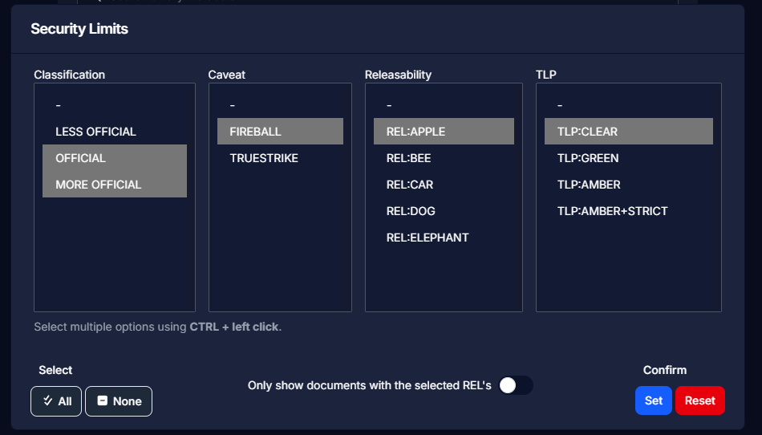
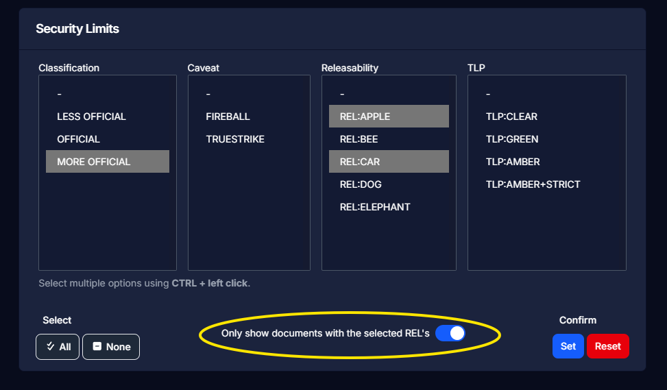

# Filtering on Security

Azul enables filtering on Security. Simply click on the security string on the top-middle of the page:

Once you have clicked the security string you should see the filter pop up:

Clicking the All button in the lower left will select all of the options for you; Clicking the None button next to it will deselect every option.
Holding the CTRL key while left clicking on the security options will allow you to select individual options.
Holding the SHIFT key will allow you to select many options at once; E.g. LESS OFFICIAL is selected - holding SHIFT and selecting MORE OFFICIAL will also select OFFICIAL. 

## Filtering on Security using OR filter

By default, Azul uses OR queries to return binaries. So the below example will run a query like this:
Find binaries with the security markings OFFICIAL OR MORE OFFICIAL OR REL:APPLE OR TLP:CLEAR

## Filtering on Security using AND filter

Clicking the "Only show documents with the selected REL's" switch will set the filter to search using an AND query.
This will only come into effect if a releaseability is selected. So the below example will run a query like this: 
Find binaries with the security markings REL:APPLE AND REL:CAR

