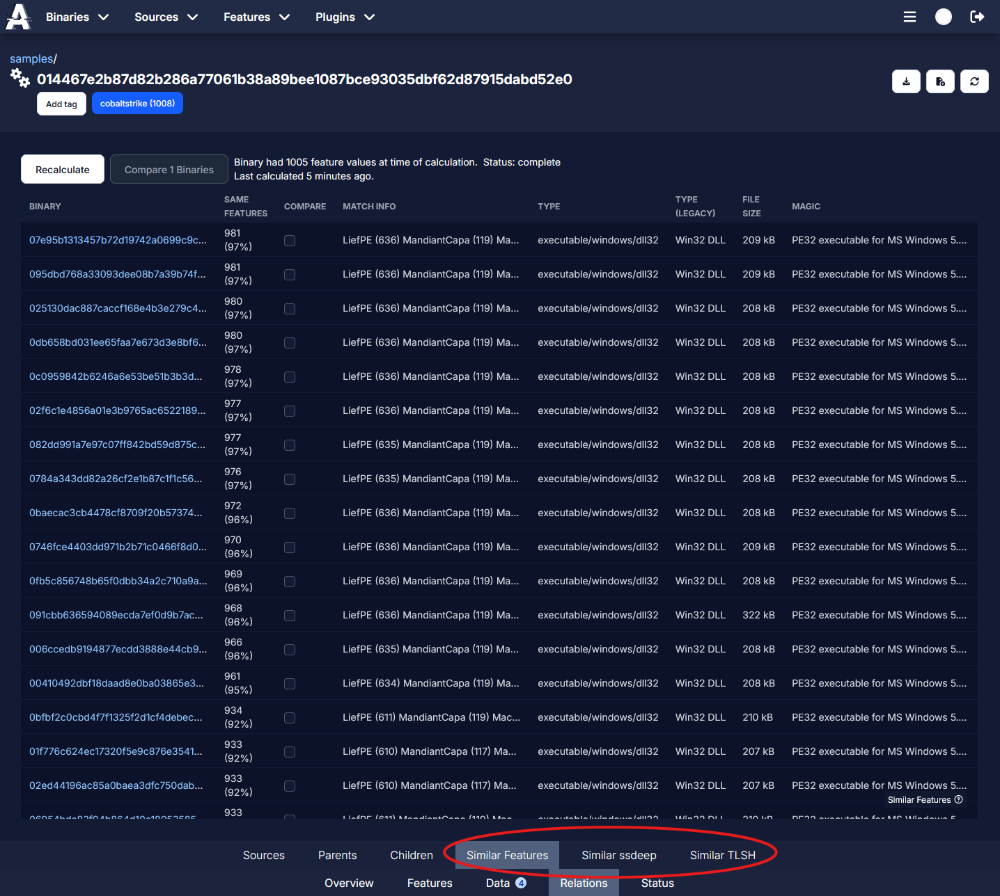
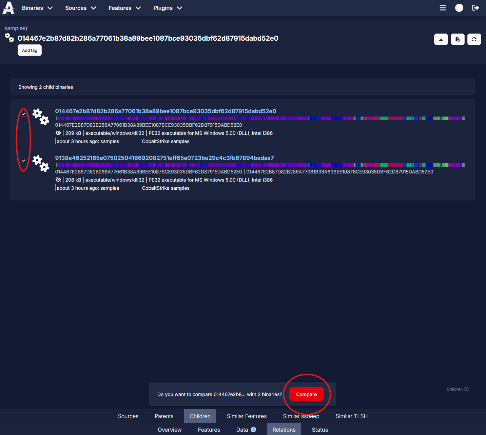
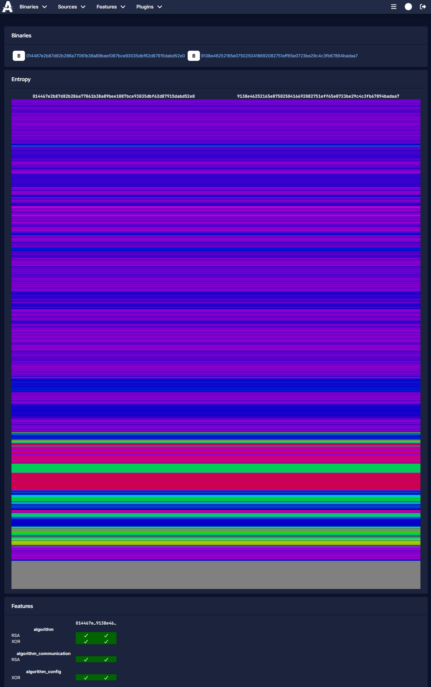

# Similarity and Comparing Samples

Azul enables finding similar samples and comparing samples by features.

## Similarity

Azul enables finding similar binaries based on features and fuzzy hashes such as ssdeep and TLSH. These can be found in a binary's Relations page.

## Compare

The Compare page can be used to further investigate similarities between binaries in Azul. You can compare two or more binaries by selecting the tick boxes when searching for binaries in the Binary Explore page, or on a binary's Relations pages. The Compare page will display each binary and their features side by side, including their entropy.

Note that binaries in Azul which do not have content will have a limited number of features to compare, and will not have any entropy calculated.

